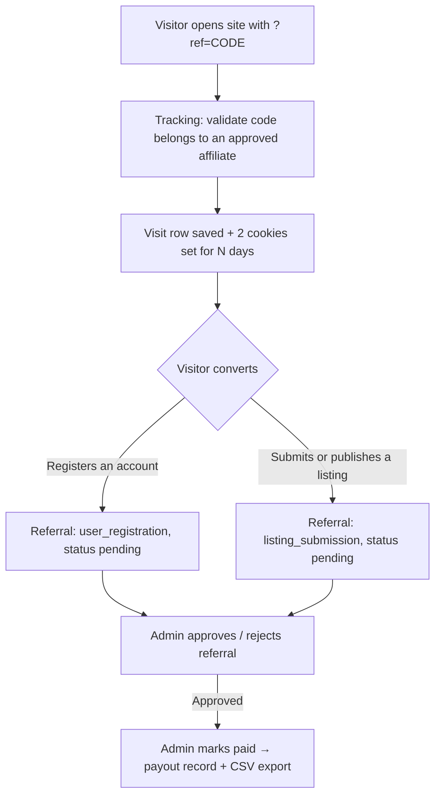

# Directorist – Affiliate

Affiliate tracking and fixed-commission referral system for [Directorist](https://directorist.com/). It lets people apply to become affiliates, hands each approved affiliate a referral link, tracks visits through that link with cookies, and records a fixed commission whenever a referred visitor **registers an account** or **submits/publishes a listing**. Admins moderate affiliates and referrals, record manual payouts, and export approved commissions as CSV.

## At a glance

| Item | Value |
| --- | --- |
| Version | 1.13.0 (plugin) / 0.3.0 (DB schema) |
| Author | [wpXplore](https://wpxplore.com) |
| Website | https://wpxplore.com/tools/directorist-affiliate/ |
| Requires | WordPress 6.3+, PHP 7.4+ |
| Depends on | Directorist ≥ 8.7.3 (declared via `Requires Plugins: directorist`) |
| Text domain | `directorist-affiliate` — fully translatable (Loco Translate, Poedit, any `.mo`); POT template at `languages/directorist-affiliate.pot`. **WPML/Polylang ready**: admin-entered wording is exposed via `wpml-config.xml` and registered for string translation |
| Commission model | Fixed amounts for registration/listing events; **fixed or percentage of order total** for paid plan/featured orders; all filterable |
| Revenue events | Pricing-plan purchases and featured-listing purchases. Both follow **your settings toggles only** — featured listings are core Directorist, not a Pricing Plans feature, so neither is gated on extension detection |
| Payouts | Manual (recorded by admin; no gateway integration). Affiliates can **request** a payout from their dashboard; per-affiliate minimum enforced on both bulk payouts and requests |
| Assets | One front-end stylesheet + one admin stylesheet + one vanilla JS file (AJAX forms, copy link, link builder, bulk select) |
| Emails | Seven notifications, each with **editable subject and body** in a modal, placeholder tokens, and independent on/off toggles |
| Forms | All forms submit via AJAX (`admin-ajax.php`) with full no-JavaScript POST fallbacks |
| User guide | [DOCUMENTATION.md](DOCUMENTATION.md) |

## How it works (big picture)



1. **Application** – A visitor applies via the `[directorist_affiliate_registration]` shortcode (or an admin adds them manually). A WordPress user is created for them if needed. The application starts as `pending`.
2. **Approval** – An admin approves the affiliate; they get a unique referral code and a referral URL like `https://site.com/?ref=CODE`.
3. **Tracking** – When someone lands on any front-end page with `?ref=CODE` (of an approved affiliate), a visit row is logged and two cookies are set for the configured duration.
4. **Conversion** – If that visitor registers, or submits/publishes a listing, a referral row with a fixed commission amount is created (`pending`), the visit is flagged converted, and the affiliate is emailed.
5. **Moderation & payout** – The admin approves referrals, then marks them paid (individually or in bulk), which writes a payout record. Approved commissions can be exported to CSV for processing in a payment tool.

## File structure

```
directorist-affiliate/
├── directorist-affiliate.php            # Bootstrap: constants, autoloader, activation hooks, boot
├── uninstall.php                        # Opt-in data removal on plugin delete
├── .gitignore
├── README.md                            # Technical reference (this file)
├── DOCUMENTATION.md                     # Site-owner user guide
├── docs/
│   └── images/                          # Screenshots/video thumbnail referenced by DOCUMENTATION.md
├── includes/
│   ├── class-autoloader.php             # Classmap autoloader (lazy class loading)
│   ├── class-date-range.php             # Date-range presets → MySQL datetime bounds
│   ├── class-link-search.php            # Link builder: content search + URL validation
│   ├── class-plugin.php                 # Service container / dependency checks
│   ├── class-activator.php              # dbDelta table creation + default options
│   ├── class-deactivator.php            # flush_rewrite_rules only
│   ├── class-view.php                   # Shared view/template renderer
│   ├── class-registration.php           # Application processing (public + admin flows)
│   ├── class-ajax.php                   # AJAX endpoints for all forms
│   ├── class-settings.php               # Settings read/sanitize/save
│   ├── class-affiliate.php              # Affiliate repository (CRUD, codes, user helper)
│   ├── class-referral.php               # Referral repository (CRUD, sums, dedupe)
│   ├── class-tracking.php               # ?ref= capture, cookies, visit rows
│   ├── class-commission.php             # Fixed commission amount resolution (filterable)
│   ├── class-payout.php                 # Manual payout records
│   ├── class-email.php                  # wp_mail notifications
│   ├── class-shortcodes.php             # Registration + dashboard shortcodes
│   ├── class-directorist-integration.php# Registration/listing referrals + dashboard tab
│   └── class-order-integration.php      # Paid-order commissions (new + legacy orders), refund reversal
├── admin/
│   ├── class-admin.php                  # Menu, assets, filter parsing, screen rendering
│   ├── class-admin-actions.php          # Form/moderation handlers + CSV export
│   └── views/                           # dashboard, affiliates, referrals, visits,
│       │                                # payouts-unpaid, payouts-history, settings
│       └── partials/                    # filter-bar.php, payout-sections.php
├── public/
│   ├── class-public.php                 # Front-end asset registration + tracking hook
│   └── views/                           # registration-form.php, affiliate-dashboard.php
├── assets/
│   ├── css/directorist-affiliate.css        # Front-end styles (tokens, hero, stat tiles, badges, tables)
│   ├── css/directorist-affiliate-admin.css  # Admin styles (shell, tabs, toggles, filters, pagination)
│   └── js/directorist-affiliate.js          # Copy link, link builder, AJAX forms, bulk select, sub-tabs
└── languages/                           # (empty)
```

Layering: `directorist-affiliate.php` → `Plugin` container → repositories/services in `includes/` → thin hook classes (`Admin`, `Admin_Actions`, `Public`, `Shortcodes`, `Directorist_Integration`) → templates in `admin/views/` + `public/views/` rendered through `Directorist_Affiliate_View`. Only the bootstrap trio (Plugin, Activator, Deactivator) plus the autoloader are loaded eagerly; every other class loads on first use via the classmap, so admin-only classes never load on front-end requests.

## Bootstrap flow

`directorist-affiliate.php` defines constants (`DIRECTORIST_AFFILIATE_VERSION`, `_DB_VERSION`, `_MIN_DIRECTORIST`, paths) and calls `Directorist_Affiliate_Plugin::boot()`, which registers:

- `plugins_loaded` → dependency check: admin notice if Directorist is missing (`ATBDP()` / `ATBDP_VERSION`) or older than **8.7.3**.
- `plugins_loaded` → text domain loading.
- `directorist_loaded` → singleton instantiation. The container (`Directorist_Affiliate_Plugin::instance()`) builds the services (`settings`, `affiliate`, `tracking`, `referral`, `commission`, `payout`, `email`, `shortcodes`) — class files load on demand via `Directorist_Affiliate_Autoloader` — and registers hook classes: `Public`, `Shortcodes`, `Directorist_Integration`, plus `Admin` and `Admin_Actions` (admin only). Hooks are skipped entirely if the installed Directorist is below the minimum version.

**Activation** hard-blocks (deactivates itself + `wp_die`) unless `directorist/directorist-base.php` is active, then creates tables via `dbDelta()` and seeds default settings. **Deactivation** only flushes rewrite rules — no data is removed. **Uninstall** (`uninstall.php`) removes the four tables, both options, and the related user meta, but only when the "Delete data on uninstall" setting is enabled; otherwise data survives uninstall.

## Database schema

Four custom tables (all `dbDelta`-managed, version tracked in option `directorist_affiliate_db_version`):

### `{prefix}directorist_affiliates`
| Column | Notes |
| --- | --- |
| `id` | PK |
| `user_id` | Linked WP user (nullable, indexed) |
| `status` | `pending` \| `approved` \| `rejected` \| `suspended` (indexed) |
| `referral_code` | **Unique**. Generated from user ID (or an 8-char random string), suffixed `-1`, `-2`… on collision |
| `payout_email`, `website`, `promotional_method`, `application_note` | Application data |
| `payout_method`, `payout_details` | Chosen payout method and its details as JSON (added in DB 0.3.0) |
| `date_created`, `date_updated` | Timestamps |

### `{prefix}directorist_affiliate_visits`
| Column | Notes |
| --- | --- |
| `id` | PK |
| `affiliate_id`, `referral_code` | Who the visit is credited to (indexed) |
| `landing_url`, `referrer_url` | Where they landed / came from |
| `ip_address`, `user_agent` | Visitor fingerprint (IP from `REMOTE_ADDR` only) |
| `converted` | 0/1 flag (indexed), set when the visit leads to a referral |
| `referred_user_id`, `listing_id` | Filled on conversion |
| `date_created` | Timestamp (indexed) |

### `{prefix}directorist_affiliate_referrals`
| Column | Notes |
| --- | --- |
| `id` | PK |
| `affiliate_id` | Indexed |
| `referral_type` | `user_registration` \| `listing_submission` \| `plan_purchase` \| `featured_purchase` |
| `referred_user_id`, `listing_id` | Conversion subject (indexed) |
| `order_id`, `order_source`, `order_total` | For order events: the paid order (`directorist` = 8.8+ order repository, `legacy` = `atbdp_orders` post), and its total at commission time (order_id indexed) |
| `commission_amount` | `decimal(18,6)`, amount snapshotted at creation |
| `status` | `pending` \| `approved` \| `rejected` \| `paid` \| `cancelled` \| `refunded` (indexed) |
| `date_created`, `date_approved`, `date_paid`, `notes` | Lifecycle metadata |

### `{prefix}directorist_affiliate_payouts`
| Column | Notes |
| --- | --- |
| `id` | PK |
| `affiliate_id` | Indexed |
| `amount` | Sum of the included referrals' commissions |
| `status` | Always `paid` currently |
| `payment_method` | Always `manual` currently |
| `payout_email` | Snapshot of where to send money |
| `referral_ids` | Comma-separated referral IDs covered by this payout |
| `date_created`, `date_paid`, `notes` | Metadata |

## Core services

| Class | Responsibility |
| --- | --- |
| `Directorist_Affiliate_Settings` | Reads/saves the `directorist_affiliate_settings` option with defaults + sanitization (amounts normalized to `0.00` strings, trigger whitelisted, cookie days ≥ 1). |
| `Directorist_Affiliate_Affiliate` | Affiliate CRUD, status transitions, unique referral-code generation, lookups by ID / user / approved code, display name/email helpers. |
| `Directorist_Affiliate_Tracking` | Captures `?ref=` visits on `template_redirect` (priority 1), writes visit rows, sets/reads cookies, marks visits converted. |
| `Directorist_Affiliate_Referral` | Referral CRUD with **duplicate prevention** (one referral per affiliate + type + user/listing), status updates with date stamping, counts and commission sums. |
| `Directorist_Affiliate_Commission` | Resolves commission amounts per event — fixed for registration/listing, fixed **or percentage of order total** for plan/featured orders. Returns `null` (= don't record) when the system/event is disabled **or the required extension is inactive** (`is_pricing_plans_active()`, `is_featured_monetization_active()`). Also owns the auto-approve default status. |
| `Directorist_Affiliate_Order_Integration` | Listens to both Directorist order systems, creates commissions on paid plan/featured orders (deduped per order), and reverses them to `cancelled`/`refunded` when the order is refunded, cancelled, failed, or expired. |
| `Directorist_Affiliate_Payout` | `mark_paid()` validates referrals (must belong to the affiliate and be `approved`), sums them, inserts a payout row, and flips referrals to `paid`. Skips zero-amount payouts. |
| `Directorist_Affiliate_Email` | Plain-text `wp_mail` notices: new application → admin; approve/reject decision → affiliate; new referral recorded → affiliate. Each is individually toggleable in Settings → Notifications. |
| `Directorist_Affiliate_Date_Range` | Turns a preset (`today`, `this_week`, `last_month`, `last_30`, …) or a custom start/end pair into inclusive MySQL datetime bounds in the site's timezone. Honors `start_of_week`, validates dates with `checkdate()`, and swaps reversed custom ranges. |
| `Directorist_Affiliate_View` | Static template renderer (`output()` prints, `render()` returns a string, `partial()` renders an admin partial with an isolated context) used by both admin screens and shortcodes. |
| `Directorist_Affiliate_Autoloader` | Classmap `spl_autoload_register` loader; the map doubles as the plugin's class inventory. |
| `Directorist_Affiliate_Registration` | Application processing shared by every entry point: `process_public()` (application gates, honeypot, per-IP rate limit of 5/hour for guests, validation, account creation, pending application) and `process_admin()` (status choice, user reuse). Callers do nonce/capability checks. |
| `Directorist_Affiliate_Ajax` | All `admin-ajax.php` endpoints, returning JSON via `wp_send_json_*`. Admin (via `guard_admin()`: capability + nonce) — `directorist_affiliate_add_affiliate`, `directorist_affiliate_save_settings`, `directorist_affiliate_mark_paid`. Affiliate (via `guard_affiliate()`: nonce + approved affiliate row) — `directorist_affiliate_search_content`, `directorist_affiliate_custom_link`, `directorist_affiliate_request_payout`, `directorist_affiliate_save_payout_method`. Public — `directorist_affiliate_register` only, the one action registered for `nopriv`. |

## Visit tracking details

- Runs on the front end only, and only when the system is enabled in settings.
- The URL parameter name is configurable (`ref` by default) — e.g. `https://site.com/any-page/?ref=42`.
- The code must belong to an **approved** affiliate; logged-in affiliates visiting their own link are ignored (self-referral guard #1).
- Two cookies are set, `HttpOnly`, `SameSite=Lax`, `secure` when SSL. Each carries a **signed** payload of `v1.<id>-<timestamp>.<HMAC>`, signed with `wp_salt( 'auth' )` — a tampered or forged value is read as absent:
  - `directorist_affiliate_ref` → affiliate ID + **first-click timestamp**
  - `directorist_affiliate_visit` → visit row ID + **last-counted timestamp**
- Unsigned cookies written before 1.3.0 are still honored so live referral windows survive the upgrade, and are replaced with a signed cookie on the visitor's next tracked hit. That fallback can be removed once the longest cookie duration in use has elapsed since upgrading.
- **The window does not slide.** Expiry is anchored to the first click, so "first click keeps the credit for 30 days" means exactly 30 days, not 30 days after the visitor's most recent return. Once a window lapses, the next click starts a fresh one.
- **Visits are deduplicated.** One visit row per affiliate per visitor per window (one day, filterable via `directorist_affiliate_visit_dedupe_window`). Reloading a referral link, or clicking it again the same day, does not manufacture new clicks — which keeps the conversion rate honest.
- Attribution is configurable: **first click** (default, per PRD — an existing valid credit is never overwritten until the cookie expires) or **last click** (each valid `?ref=` hit overwrites the credit). Every counted hit creates a visit row.
- Obvious crawler traffic (bot/crawler/spider/headless/curl user agents, and requests with no user agent) is skipped, as are **speculative prefetches** — Chrome and Safari fetch links on hover with a real browser UA, and those would otherwise log clicks nobody made (`Sec-Purpose`, `Purpose`, `X-Purpose`, `X-Moz`). Capture also bails if headers were already sent.
- Tracking can be suppressed entirely by a consent manager: return false from `directorist_affiliate_should_track( $should_track, $code )` and no cookie is written.

## Conversion → referral creation

`Directorist_Affiliate_Directorist_Integration` listens to:

| Hook | Purpose |
| --- | --- |
| `user_register` + `atbdp_user_registration_completed` | Registration conversions |
| `atbdp_after_created_listing` | Listing conversions when trigger = `submission` |
| `transition_post_status` (→ `publish`, Directorist post type only) | Listing conversions when trigger = `publish` |
| `directorist_after_order_create` / `directorist_after_order_update` (Directorist 8.8+ order repository) | Paid-order commissions: `ref_type` `pricing_plan` → `plan_purchase`, `featured_listing`/featured flag → `featured_purchase`; reversal when the order becomes refunded/cancelled/failed/expired |
| `atbdp_order_completed` + `atbdp_order_status_changed` (legacy `atbdp_orders`) | Same for the classic checkout: `_fm_plans` meta → plan, `_featured` meta → featured; admin status changes to cancelled/refunded reverse the commission |
| `directorist_dashboard_tabs` (filter) | Adds an "Affiliate" tab to the Directorist user dashboard |

**Paid order flow:** when an order reaches **paid**, the integration computes the total exactly like core (`sub_total` + tax − coupon, falling back to the stored amount), resolves the affiliate (tracking cookie first, then the affiliate recorded at the buyer's registration), applies the self-referral and per-order duplicate guards, and creates a `plan_purchase`/`featured_purchase` referral storing the order ID, source, and total. Free (0.00) orders never earn. If the order is later refunded or cancelled, the referral flips to `refunded`/`cancelled` and drops out of payable sums; `directorist_affiliate_referral_reversed` fires for extensions.

**Registration flow:** affiliate read from cookie → must be approved and not the registering user themselves (self-referral guard #2) → user meta `_directorist_affiliate_id` / `_directorist_affiliate_visit_id` stored on the new user **regardless of whether the registration commission event is enabled**, so later conversions still attribute → if the event is enabled, a `pending` referral is created, the visit marked converted, and the affiliate emailed.

**Listing flow:** affiliate resolved from the author's `_directorist_affiliate_id` user meta first, falling back to the live cookie **only when the current session belongs to the listing author** — so a listing posted days after registration still credits the original affiliate, while a moderator publishing someone else's listing can never leak their own cookie into the attribution. Same approval/self-referral guards, then a `listing_submission` referral is created, the visit marked converted, and the affiliate emailed.

**Cookie trust rule (all order/listing events):** the tracking cookie belongs to a browser session, so it is only consulted when the current user *is* the converting user (or a guest completing their own checkout). Admin-side events — offline-payment approval, order status edits, moderator publishing — attribute exclusively through the persisted user meta. The first affiliate credited to a user is written to user meta and never overwritten, which keeps first-click semantics across devices and cookie expiry.

Both paths are idempotent: `Referral::create()` returns the existing row if a referral for the same affiliate + type + user/listing already exists, so double-firing hooks can't double-pay.

## Admin area

One tabbed **Affiliate** page registered as a submenu of the Directorist listings menu (`edit.php?post_type=at_biz_dir`, page slug `directorist-affiliate`, `manage_options`). The shell renders a header (title, version chip, tagline) and a six-tab navigation (`?tab=…`, dashicons, whitelisted via `sanitize_key`); `Directorist_Affiliate_Admin::page_url( $tab, $args )` is the canonical URL builder used by every internal link, redirect, and email. Bookmarks to the old standalone `directorist-affiliate-*` pages 301 to the matching tab on `admin_init`.

| Tab (`?tab=`) | Contents / actions |
| --- | --- |
| `dashboard` | Stat tiles (affiliates + pending-application shortcut, visits with conversion rate, referrals) and commission tiles (pending / approved / paid), plus the 8 most recent referrals. |
| `affiliates` | An **Add affiliate** button leads the filter bar and opens a native `<dialog>` **modal** (creates/reuses a WP user, can start as approved); affiliate detail card; filters (status, search across name/email/code/website, applied-date range); **paginated** table (20/page) with per-row Approve / Reject / Suspend links (nonce-protected; the action matching the current status is hidden) and referral/commission rollups from one grouped query. |
| `referrals` | Filters: **affiliate, event type, status, and date range**; 20/page; **bulk actions** (Approve / Reject / Mark as paid) alongside per-row actions. "Mark paid" is **restricted to `approved` referrals** and always routes through the payout service so every payment leaves a payout record; other statuses get an error notice. |
| `visits` | Filters: **affiliate, converted/not converted, and date range**; 20/page. Columns: affiliate + code, landing path, referring host, IP, timestamp, converted badge. |
| `payouts` | Three sub-tabs (`&section=`). **Requests** (`requests`) — open claims from affiliates with **Mark paid** / **Reject**; it is the default landing section whenever any are outstanding, and the sub-tab label carries a count. **Unpaid approved commissions** (`unpaid`, default): outstanding-balance toolbar, checkbox list with select-all → "Mark selected as paid" (grouped into one payout per affiliate, **skipping affiliates below the configured minimum payout** with a warning notice), and **Export approved payouts CSV** (up to 1,000 rows: affiliate_id, payout_email, referral_id, amount, date_created — cells starting with `=`/`+`/`-`/`@` are neutralized against spreadsheet formula injection). **Payout history** (`history`): settled payouts only (`paid` + `rejected`, since open requests have their own tab), filtered by **affiliate, payout email, and date range** with a total-paid summary and a status column, 20/page. |
| `settings` | The settings form below, organized into pill-style sub-tabs (General / Commissions / Payout / Notifications / Advanced) with toggle switches, inline field descriptions, and a **sticky save bar**. One form underneath — a single save submits every section (AJAX with POST fallback); JS-off renders the sections stacked. Sub-tab state is kept in the URL hash (`#da-general`); leaving with unsaved changes warns first. |

Tab rendering lives in `Directorist_Affiliate_Admin`; all mutations live in `Directorist_Affiliate_Admin_Actions`, run through `admin_init`, are capability-checked (`manage_options`) and nonce-verified (`check_admin_referer`), then redirect back to the relevant tab with a success/error notice (or return JSON via the AJAX endpoints).

## Frontend

**Forms are AJAX-first with no-JS fallbacks.** Every form carries a `data-da-ajax` attribute; the shared JS intercepts submit, posts to `admin-ajax.php`, and shows the JSON response inline (invalid input no longer loses what was typed). Without JavaScript, forms fall back to normal POSTs: the front-end registration POST is processed **exactly once on `template_redirect`** (a once-guard prevents the double-processing that occurs when themes/SEO plugins render shortcodes multiple times per request — previously this could report "You already have an affiliate application" on a successful first submit), and admin POSTs are processed on `admin_init` as before. Both paths run the same `Registration`/`Payout` service methods.

**Shortcodes**

- `[directorist_affiliate_registration]` — Application form opening with a **"What you earn" panel built from live settings** (`Commission::program_terms()` — only events that are enabled *and* whose dependency is active, plus the cookie duration), so applicants can see the offer before committing. Fields are grouped into *About you* / *How you will promote us* / *Getting paid*, with an invisible **honeypot anti-spam field** (bot submissions are silently discarded). For visitors who aren't logged in it **creates a WordPress account** via the shared `Affiliate::register_user()` helper (username derived from the email local-part, random password, standard new-user email). If the email already belongs to an account, it asks them to log in first. One application per user.
- `[directorist_affiliate_dashboard]` — For logged-in affiliates, split into five tabs. **Summary** (default) carries the earnings tiles — *Ready to be paid* leading, with a progress bar toward the payout minimum and the shortfall, then pending, paid-to-date, and traffic. The conversion rate is **converted visits ÷ visits**, not referrals ÷ visits — one visit can produce several referrals, so the latter can exceed 100%. **Your link** holds the referral link, the link builder and the share buttons in one block. **Referrals** lists their referral history. **Payouts** holds *How you get paid* (referral code, minimum, instructions), the **Request payout** button and payout history. **Settings** holds the payout method and its details. Tabs that would be empty are not rendered: an unapproved affiliate sees neither *Your link* nor *Settings*, and status-specific banners explain pending, suspended and rejected accounts instead.
- `[directorist_affiliate_link page="add-listing" text="Add your business"]` — Renders the current affiliate's referral link to a named Directorist page (`home`, `add-listing`, `all-listings`, `dashboard`, `checkout`) or an explicit same-site `url`. Outputs nothing for visitors who are not approved affiliates.

**Directorist dashboard tab** — The same dashboard renders inside Directorist's user dashboard as an "Affiliate" tab (icon `las la-handshake`) via the `directorist_dashboard_tabs` filter.

The registration shortcode also respects the application gates: it shows a "closed" notice when `enable_applications` is off and a login prompt when `applications_require_login` is on.

### Link builder

The dashboard's single **"Your referral link"** section holds the link field, the builder controls and the share buttons. A type dropdown (`Directorist_Affiliate_Link_Search::types()`) offers **Home page, Page, Post, Listing, Category, Location, Custom link**. **Home page** is the default and needs no input (`kind => none`), so the section opens with a usable referral link already in the box; the Directorist entries drop out automatically when the post type or taxonomy is not registered, so it never offers a search that cannot return anything.

Picking a content type reveals a title search; picking Custom link reveals a URL field instead. Both are backed by AJAX:

| Action | Input | Returns |
| --- | --- | --- |
| `directorist_affiliate_search_content` | `type`, `term` | Up to 10 `{id, title, url, link}` matches |
| `directorist_affiliate_custom_link` | `url` | The validated referral `link`, or a 400 with the reason |

Both go through `guard_affiliate()`: nonce (`directorist_affiliate_link_builder`) **and** an approved affiliate record — there is no `nopriv` registration. **The referral code always comes from the affiliate's database row**, never from the request, so a tampered payload cannot mint a link for someone else.

Searches match **titles only** (`posts_search` filtered for the duration of one query; taxonomies use `name__like`), because an affiliate is looking for something they can already name and body-copy matches are noise. Terms shorter than 2 characters are never queried, terms are capped at 100 characters, and results are limited to published, non-password-protected content.

Custom URLs are validated server-side, since only the server knows what counts as "on this site": the host must match `home_url()` (ignoring `www.`), the scheme must be http(s), and `/wp-admin` and `wp-login.php` are refused. Bare paths (`/pricing/`) and scheme-less hosts are resolved rather than rejected. Every refusal explains itself.

The **Share via** buttons (WhatsApp, X, Facebook, email) are rebuilt in JavaScript whenever the link changes, so sharing always sends whatever was just built rather than the rendered home link. They are plain anchors, so they still work — pointed at the home referral link — without JavaScript.

The builder's JavaScript lives in its own file (`assets/js/link-builder.js`) enqueued **only by the dashboard shortcode, and only for approved affiliates** — it never loads elsewhere on the site. The combobox implements the ARIA pattern (arrow keys, Enter, Escape), debounces at 300ms, and aborts superseded requests so a slow earlier search cannot overwrite a newer one.

### Payout methods

Affiliates are paid one of three ways, defined once in `Directorist_Affiliate_Payout_Methods::all()` and generated from there everywhere else — the dashboard form, the request modal, and the admin summary:

| Method | Asks for |
| --- | --- |
| **PayPal** | PayPal email |
| **Bank transfer** | Account holder name, bank name, account number/IBAN, plus optional routing/SWIFT/BIC |
| **Cash** | Phone number |

The admin chooses which are offered (Settings → Payout → *Available payout methods*, stored in `payout_methods`). Unticking everything falls back to all three rather than silently disabling payouts. Adding a method means adding one entry to `all()`, or hooking `directorist_affiliate_payout_methods`.

Affiliates set a default in the dashboard's **Payout settings** section, saved through `directorist_affiliate_save_payout_method`. Details are validated per field type (`email` must parse, `tel` keeps only digits and phone punctuation, text is `sanitize_text_field`), required fields are enforced, and unknown keys are dropped. Stored as JSON on `affiliates.payout_details`, with `payout_method` alongside; for methods carrying an email, `payout_email` is kept in sync so existing screens and exports still work.

**Each payout snapshots the method and details it used** (`payouts.payment_method` + `payouts.payout_details`), so changing a bank account later never rewrites what an earlier payment recorded.

### Payout requests

Affiliates claim their approved commissions from the dashboard rather than waiting to be noticed. **Request payout** opens a `<dialog>` modal showing the amount (server-rendered — never an editable field) and their payout email, and posts to `directorist_affiliate_request_payout` through the same `guard_affiliate()` gate as the link builder.

The lifecycle is `requested → paid | rejected`, all on the existing `status` column, so **no schema change**:

| Step | What happens |
| --- | --- |
| **Request** | Writes a `requested` payout row covering every currently-approved commission, recording their IDs and a snapshot of the payout method. The referrals stay `approved` — no money has moved and the request may still be declined. One open request per affiliate. |
| **Mark paid** | **Recalculates** the amount from the referrals that are *still* approved (a commission can be refunded between request and payment), flips those to `paid`, stores the corrected amount and covered IDs, and stamps `date_paid`. Refuses if nothing is payable any more. |
| **Reject** | Marks the row `rejected` with a reason; the commissions stay in the affiliate's balance so they can request again. |

**Payout details are required to request.** If a usable default is on file the modal shows it with a *Change* button and nothing needs retyping; if not, the method picker and its fields are shown and must be completed. Whatever is submitted becomes the new default. Server-side, `resolve_payout_method()` accepts submitted details, or falls back to the saved default only when it is complete for a still-enabled method.

Requesting is blocked — with the reason shown, not just a disabled button — when the affiliate is unapproved, has no approved balance, is below `minimum_payout`, or already has an open request. The amount and covered referrals are always derived server-side from the affiliate's own rows.

Admin-initiated bulk payouts (Payouts → Unpaid) are unchanged and still write `paid` rows directly.

**Existing affiliates are redirected to their dashboard.** A logged-in user who already has an affiliate record and opens a page containing `[directorist_affiliate_registration]` is sent to the dashboard instead of being shown a form they cannot use. The redirect runs on `template_redirect` (priority 5) — a shortcode renders inside `the_content`, by which point headers are already sent — and bails on any of: no affiliate record, a POST in flight, a page that also hosts the dashboard shortcode, or no dashboard destination. The destination is `dashboard_page` if set, else Directorist's own user dashboard (which carries the Affiliate tab), and is filterable via `directorist_affiliate_dashboard_url`. When no destination exists the form falls back to an "already applied" notice, linking to the dashboard when one is known.

Views are rendered with a tiny `ob_start()`/`extract()` template loader. Assets: `assets/css/directorist-affiliate.css` (front end, registered as `directorist-affiliate`), `assets/css/directorist-affiliate-admin.css` (admin only), and one vanilla JS file shared by both, enqueued with `strategy => defer`.

**Front-end styling is theme-proof by construction.** These blocks render inside whatever theme the site runs, so every rule is scoped to `.directorist-affiliate-wrap` and each element a theme is likely to restyle (`button`, `input`, `table`, `fieldset`, `legend`) is reset explicitly rather than left to inherit — there are no unscoped element selectors in the stylesheet. Typography deliberately inherits the theme's font family so the block belongs to the page; only size, weight and rhythm are the plugin's. Colours are `--da-*` custom properties, so a theme can set `--da-accent` on `.directorist-affiliate-wrap` to match its brand. **The block renders light by default and only goes dark when a theme opts in** by putting `da-dark` on the wrapper or any ancestor — deliberately *not* wired to `prefers-color-scheme`, which reports the visitor's OS preference and says nothing about the theme the block was dropped into. Tables collapse into labelled cards under 720px.

## List filtering

Every list screen shares one GET-based filter bar (`admin/views/partials/filter-bar.php`), so filters are bookmarkable, survive pagination, and need no JavaScript. `Directorist_Affiliate_Admin::request_filters()` parses the request once; `pagination_args()` reduces it to the non-empty query vars that pagination links must carry.

| Screen | Query vars |
| --- | --- |
| Affiliates | `status`, `s` (name/email/code/website), date range |
| Referrals | `affiliate`, `type`, `status`, date range |
| Visits | `affiliate`, `converted` (`1`/`0`), date range |
| Payouts → history | `affiliate`, `email`, date range |

**Date range** is shared by all four: `range` holds a preset (`today`, `yesterday`, `this_week`, `last_week`, `this_month`, `last_month`, `last_7`, `last_30`, `this_year`) or `custom`, in which case `from` and `to` carry `Y-m-d` dates. Picking a preset auto-submits; choosing "Custom range…" reveals two native date inputs. Bounds are inclusive and computed in the site's timezone — `this_week` respects the `start_of_week` option, and a reversed custom range is swapped rather than returning nothing. Referrals, visits, and affiliates filter on `date_created`; payout history filters on `COALESCE(date_paid, date_created)`, so "paid in March" means what an admin expects.

Affiliate filters are a dropdown built from `Affiliate::options()` rather than a text field, so they always resolve to a real affiliate ID.

The bar also takes an optional `lead_button` (`array{modal, label}`), rendered as the first control — used by the Affiliates screen for "Add affiliate". It is a `type="button"`, so it opens the modal without submitting the surrounding GET form. It carries the plugin's own `.directorist-affiliate-add-btn` styling rather than WordPress's `.button-primary`, whose `:focus` rule paints a white inner ring that lingers after a mouse click; keyboard focus still shows a ring via `:focus-visible`.

## Settings reference

Stored in one option, `directorist_affiliate_settings` (autoload off):

| Key | Default | Meaning |
| --- | --- | --- |
| `enabled` | `1` | Master on/off for tracking + commissions |
| `ref_param` | `ref` | Query-string parameter for referral links |
| `cookie_duration` | `30` | Cookie lifetime in days (clamped to 1–3650) |
| `enable_applications` | `1` | Accept new affiliate applications (form shows a "closed" notice when off) |
| `dashboard_page` | `0` | Page holding `[directorist_affiliate_dashboard]`. Existing affiliates who open the application page are redirected here; `0` falls back to Directorist's user dashboard |
| `applications_require_login` | `0` | Require a WordPress account to apply; when off, applying creates one |
| `enable_registration` | `1` | Pay commission on referred user registration |
| `registration_amount` | `0.00` | Fixed amount per registration |
| `registration_credit_on` | `registration` | When it is credited: `registration`, or `verification` (waits for Directorist email verification) |
| `registration_user_types` | `['author','general']` | Which Directorist user types earn it. Empty falls back to both |
| `enable_listing` | `1` | Pay commission on referred listing |
| `listing_amount` | `0.00` | Fixed amount per listing |
| `listing_trigger` | `submission` | `submission` (on create) or `publish` (on first publish) |
| `listing_directory_types` | `[]` | Directory type term IDs that earn a listing commission. Empty = all, including types added later |
| `attribution_model` | `first_click` | `first_click` (existing credit kept until cookie expiry) or `last_click` (newest link wins) |
| `enable_plan_commission` | `1` | Commission on pricing-plan purchases — inert unless a Pricing Plans extension is active |
| `plan_commission_type` / `plan_commission_value` | `percentage` / `0.00` | Fixed amount or % of order total (percentages capped at 100) |
| `enable_featured_commission` | `1` | Commission on featured-listing purchases — inert unless monetization + featured listings are enabled |
| `featured_commission_type` / `featured_commission_value` | `percentage` / `0.00` | Fixed amount or % of order total (percentages capped at 100) |
| `auto_approve_commissions` | `0` | Create referrals as `approved` (payable immediately) instead of `pending` |
| `minimum_payout` | `0.00` | Per-affiliate threshold enforced on the bulk "Mark selected as paid" action (`0` = disabled) |
| `payout_instructions` | `''` | Free text shown on the affiliate dashboard |
| `notify_admin_application` | `1` | Email the admin when someone applies |
| `notify_affiliate_status` | `1` | Email the applicant on approve/reject |
| `notify_affiliate_referral` | `1` | Email the affiliate when a referral converts |
| `notify_admin_payout_request` | `1` | Email the admin when an affiliate requests a payout |
| `notify_affiliate_payout` | `1` | Email the affiliate when a payout request is paid or declined |
| `anonymize_ip` | `0` | Truncate visit IPs via `wp_privacy_anonymize_ip()` at collection time |
| `delete_data_on_uninstall` | `0` | Allow `uninstall.php` to drop tables/options/user meta on plugin delete |

## Status lifecycles

- **Affiliate:** `pending` → `approved` / `rejected` / `suspended` (admin action; approve/reject trigger an email). Only `approved` affiliates get visits and referrals credited.
- **Referral:** `pending` → `approved` (stamps `date_approved`) → `paid` (stamps `date_paid`, normally via a payout record); or `rejected`. A `paid` referral is **locked**: it can only move to `refunded`/`cancelled` (an order reversal). Re-approving it would queue a second payment, so `Referral::update_status()` refuses that transition for both single-row and bulk actions.
- **Payout:** created directly as `paid` / `manual`.

## Data footprint

| Type | Keys |
| --- | --- |
| Options | `directorist_affiliate_settings`, `directorist_affiliate_db_version` |
| User meta | `_directorist_affiliate_id`, `_directorist_affiliate_visit_id` (on referred users) |
| Cookies | `directorist_affiliate_ref`, `directorist_affiliate_visit` |
| Tables | The four `directorist_affiliate*` tables above |

## Security posture

- Every table access goes through `$wpdb->prepare()`; inputs are sanitized on the way in (`sanitize_email`, `esc_url_raw`, `sanitize_key`, `absint`, …) and escaped on output (`esc_html`, `esc_url`, `esc_attr`).
- All admin actions: `manage_options` + nonces. Frontend application form: nonce-protected POST, an invisible honeypot field, a **per-IP rate limit** (5 guest applications per hour), and admin-controlled gates for whether applications are open at all and whether a login is required — so the form can never be used as an unbounded account-creation endpoint.
- CSV export neutralizes spreadsheet formula injection (cells beginning `=`, `+`, `-`, `@`, tab, or CR are prefixed with an apostrophe).
- Cookies are `HttpOnly` and marked secure on SSL. Statuses/types are validated against whitelists before being written.
- Self-referral is blocked at both the tracking and the referral-creation layers; duplicate referrals are blocked at the repository layer. The tracking cookie is only trusted for the converting user's own session (see the cookie trust rule above).
- `Payout::mark_paid()` records and flips **only** the referral IDs it validated (approved and owned by that affiliate), so an unrelated ID passed in a payout request can never be marked paid.
- Optional IP anonymization (`wp_privacy_anonymize_ip()`) for visit logs; opt-in full data removal on uninstall.
- Referrals can only be marked paid from the `approved` status, so every payment is backed by a payout record (audit trail).

## Extensibility

Actions: `directorist_affiliate_created( $affiliate_id, $status )`, `directorist_affiliate_status_changed( $affiliate_id, $status )`, `directorist_affiliate_referral_created( $referral_id, $affiliate_id, $type )`, `directorist_affiliate_referral_reversed( $referral_id, $new_status, $order_status )`, `directorist_affiliate_payout_requested( $payout_id, $affiliate_id, $amount )`, `directorist_affiliate_payout_recorded( $payout_id, $affiliate_id, $amount, $referral_ids )`, `directorist_affiliate_payout_rejected( $payout_id, $affiliate_id )`.

Filters: `directorist_affiliate_email_templates( $templates )` (default email wording and tokens), `directorist_affiliate_email_content( $email, $key, $tokens )` (rendered subject/body just before sending), `directorist_affiliate_link_types( $types )` (content types in the link builder), `directorist_affiliate_payout_methods( $methods )` (how affiliates can be paid), `directorist_affiliate_dashboard_url( $url )` (where existing affiliates are sent), `directorist_affiliate_program_terms( $terms )`, `directorist_affiliate_should_track( $should_track, $code )` (veto tracking, e.g. before cookie consent), `directorist_affiliate_visit_dedupe_window( $seconds )`, `directorist_affiliate_registration_commission( $amount )`, `directorist_affiliate_listing_commission( $amount, $trigger )`, `directorist_affiliate_plan_commission( $amount, $order_total )`, `directorist_affiliate_featured_commission( $amount, $order_total )`.

Usage examples are in [DOCUMENTATION.md](DOCUMENTATION.md#developer-reference).

## Changelog

### 1.13.0 — 2026-08-14

Editable email wording, translation support end to end, and featured listings untied from Pricing Plans.

**Featured listings are a core feature, not a Pricing Plans feature**
- Featured-listing and plan commissions are no longer disabled when the Pricing Plans extension is not detected. Featured listings live in core Directorist under *Monetization → Featured Listings* with their own price, so gating them on an unrelated extension was simply wrong.
- `Directorist_Affiliate_Commission::is_pricing_plans_active()` and `is_featured_monetization_active()` remain, but are now **advisory only** — they inform the settings screen and no longer suppress payment. A paid order cannot exist unless whatever sells it was active, so the order itself is the proof.

**Editable email templates**
- All seven notifications (application received, approved, rejected, new referral, payout requested, payout paid, payout declined) are now editable from *Settings → Notifications*, each in its own popup modal with subject, body, and the list of placeholder tokens it accepts.
- Tokens: `{site_name}`, `{site_url}`, `{affiliate_name}`, `{affiliate_email}`, `{amount}`, `{referral_type}`, `{payout_method}`, `{dashboard_url}`, `{admin_url}`.
- Leaving a field blank — or typing wording identical to the default — stores nothing, so that notification keeps following future default improvements and stays translatable through the POT. You are never silently frozen on an old default by opening the editor.
- New filters: `directorist_affiliate_email_templates( $templates )` and `directorist_affiliate_email_content( $email, $key, $tokens )`.

**Translation & WPML**
- Verified end to end: every translatable literal in the plugin reaches `languages/directorist-affiliate.pot`, and no template contains raw untranslated text. Works with Loco Translate, Poedit, or a hand-built `.mo`.
- Added `wpml-config.xml` so WPML String Translation picks up admin-entered wording (payout instructions and all seven email subjects/bodies) under *Admin Texts*.
- Email overrides are additionally registered with `wpml_register_single_string` and resolved through `wpml_translate_single_string` at send time, under the context **Directorist - Affiliate**. Defaults deliberately bypass WPML and use the text domain instead, so an untouched template is translated once for every site rather than per string.

**Also**
- Cookie duration default confirmed and documented as **30 days**.

### 1.12.0 — 2026-08-14

Three new commission controls, all reading real Directorist state rather than guessing.

**User registration**
- **Credit the commission** — *on registration* (as before) or *on email verification*, which waits for Directorist to clear its `directorist_user_email_unverified` flag. Useful for weeding out throwaway signups. If email verification is switched off in Directorist, this falls back to crediting on registration rather than never paying — and the settings screen says so when it detects that.
- **Pay for these user types** — Author (signs up to post listings) and/or User (browse only), read from Directorist's `_user_type`. Unticking both falls back to paying for both, so the setting cannot silently stop all registration commissions.

**Listing submission**
- **Pay for these directory types** — restricts listing commissions to chosen directories, read from `_directory_type`. Only shown on multi-directory sites. Ticking every box is stored as "all" rather than a list of IDs, so a directory type added later is included automatically instead of silently earning nothing.

**Implementation note.** Directorist writes `_user_type` *after* firing `atbdp_user_registration_completed`, and email verification happens on a later request entirely — so neither gate can be evaluated at registration time. Crediting is therefore re-evaluated on the `added_user_meta`/`updated_user_meta`/`deleted_user_meta` writes that carry those values. Referral creation is already deduplicated per user, so re-running is harmless. Deferred crediting resolves the affiliate from the mapping saved at registration, not the cookie, so an admin marking a user verified from their own browser still credits the right affiliate.

### 1.11.1 — 2026-08-14

Documentation corrections, found by auditing the docs against the code. No behaviour change.

- The `[directorist_affiliate_dashboard]` reference still described the **pre-tabs layout** — an "Activity card with a segmented control" and inline stat tiles. The 1.10.0 edit meant to update it targeted wording that had already changed in 1.8.0, so it silently matched nothing. It now describes all five tabs and which one holds what.
- `directorist_affiliate_link_targets` was still listed as an available filter in both the README filter list and the DOCUMENTATION hooks table, though it was removed in 1.7.0. Replaced with `directorist_affiliate_payout_methods`, which was shipped in 1.9.0 but never documented.
- The **conversion rate is now defined** where the tiles are described: converted visits ÷ visits, not referrals ÷ visits.

Mentions of removed features that remain inside older changelog entries are deliberate — a changelog records what a version did, including things later taken out.

### 1.11.0 — 2026-08-14

- **Summary is now the default tab**, holding the earnings tiles that previously sat above the tab strip.
- **Payout settings moved to its own Settings tab**, last in the strip. Payouts keeps how-you-get-paid, the request button and payout history. Settings only appears when there is something to configure — an unapproved affiliate sees neither it nor *Your link*.
- **Fix: the conversion rate could exceed 100%** — it read "400.0% converted" from 1 visit and 4 referrals. It divided *referrals* by visits, but one visit can produce several referrals (register, then buy a plan, then feature a listing). It now divides *converted visits* by visits, matching how the admin dashboard has always calculated it, so it is a true percentage.

### 1.10.0 — 2026-08-14

- **The affiliate dashboard is now tabbed**: *Your link*, *Referrals* and *Payouts*. The earnings tiles stay pinned above the tabs, since that is what an affiliate opens the page for. Everything money-out — payout settings, how you get paid, the request button and payout history — is together under Payouts.
- The old Activity card's inner segmented control is gone; Referrals and Payouts are top-level tabs instead, so there is no nesting.
- **The open tab is recorded in the URL** (`#da-payouts`). This matters beyond bookmarking: saving payout details or requesting a payout reloads the page, and without it the affiliate would be dumped back on the first tab.
- Tabs follow the ARIA tablist pattern (arrow keys move between them) and degrade to stacked sections with their own headings when JavaScript is off. The *Your link* tab is not rendered at all for affiliates who have no link yet.
- **Fix:** a disabled button showed a `progress` cursor. It is now `auto` — the label already says "Submitting…" while a form is in flight.

### 1.9.1 — 2026-08-14

Documentation corrections, found by auditing the docs against the code rather than by reading them. No behaviour change.

- **README settings table** was missing `notify_admin_payout_request` and `notify_affiliate_payout` — the 1.8.0 edit that should have added them silently matched nothing.
- **Hooks reference** was missing `directorist_affiliate_payout_requested` and `directorist_affiliate_payout_rejected`.
- **AJAX endpoint list** still described "all four forms" and named four actions; there are eight. Now grouped by the guard each one goes through, with every action name written out in full instead of an unsearchable `…_shorthand`.
- **DOCUMENTATION** now names PayPal, Bank transfer and Cash explicitly where affiliates choose a method, and lists the fields each one asks for, instead of describing them only in passing.

### 1.9.0 — 2026-08-14

**Payout methods.** Affiliates now say *how* they want to be paid, not just where.

- Three methods — **PayPal** (PayPal email), **Bank transfer** (account holder, bank, account number/IBAN, optional routing/SWIFT) and **Cash** (phone number). Each is defined once, and the dashboard form, request modal and admin views are all generated from that definition.
- **Admin picks which are available** in Settings → Payout. Unticking everything falls back to all three rather than silently blocking payouts.
- New **Payout settings** section on the affiliate dashboard to save a default; switching method swaps the fields, and non-selected fields are *disabled*, not merely hidden, so a half-filled method can never be submitted.
- **Requesting a payout requires details.** With a saved default the modal shows it and a *Change* button; without one it asks up front. Anything submitted becomes the new default.
- Validation is per field type: emails must parse, phone numbers keep only digits and phone punctuation, text is sanitized, required fields are enforced and unknown keys dropped. A method the admin later disables stops counting as a usable default.
- **Payouts snapshot the method and details used**, so changing a bank account later never rewrites an earlier payment's record. Admin Requests and History show how to pay, not just an email.

**Database:** schema 0.2.0 → **0.3.0**, adding `payout_method` and `payout_details` to affiliates and `payout_details` to payouts. Applied by `dbDelta` on upgrade; existing rows are untouched.

### 1.8.0 — 2026-08-14

**Affiliates can now request a payout** instead of waiting for the admin to notice their balance.

- **Request payout** button in the dashboard's *How you get paid* card, opening a modal with the amount and payout email. Changing the email there updates it on their account.
- Requesting is blocked, with the reason stated, when there is no approved balance, the balance is below the minimum payout, or a request is already open — one open request per affiliate.
- New **Payouts → Requests** admin sub-tab with **Mark paid** and **Reject**. It becomes the default section whenever requests are outstanding, and the sub-tab label carries a count so pending claims are visible from the Payouts tab.
- **The amount is recalculated when a request is paid**, from the commissions that are *still* approved. A commission refunded between request and payment is dropped rather than paid out, and the stored amount and covered IDs are corrected. If nothing remains payable the request cannot be paid, only rejected.
- Rejecting leaves the commissions in the affiliate's balance, so they can request again.
- Two new notification toggles: payout requested (to you) and payout decision (to the affiliate).
- Payout history now shows a status column and lists settled payouts only, since open requests have their own tab.
- Uses the existing `status` column, so there is **no database change** — `requested`, `paid` and `rejected` are the three payout statuses.

### 1.7.0 — 2026-08-14

The dashboard had two blocks doing the same job — a "Your referral link" section at the top and a separate link builder further down. They are now one section, titled **Your referral link**.

- The builder lives in that section: the link field, the type dropdown, the search/URL input and the share buttons are together, with the cookie-duration sentence explaining how long a click stays credited.
- New **Home page** type, first in the dropdown and needing no input. It is the default, so the section still opens with a working referral link already filled in — merging the two blocks would otherwise have left an affiliate with an empty box on arrival.
- **Share via** now follows the link being built. Previously the share targets were rendered once from the home URL; picking a listing and then sharing would have sent the home page. They are rebuilt whenever the link changes, and still work without JavaScript (pointed at the home referral link).
- Removed the **Quick links** row — the pages it offered (Add listing, All listings, Checkout) are all reachable through the Page search. The `directorist_affiliate_link_targets` filter went with it; `directorist_affiliate_link_types` is the extension point now. **Breaking** for anyone who had hooked the old filter.
- Removed the **More…** native share button.

### 1.6.0 — 2026-08-14

**Link builder rebuilt.** It previously offered four fixed destinations; it now reaches anything on the site.

- A type dropdown — **Page, Post, Listing, Category, Location, Custom link** — with a plain-language description under it that updates as you choose, and a tooltip on the label for the longer explanation. Directorist types disappear automatically when the post type or taxonomy is not registered.
- Choosing a content type reveals a **search-as-you-type field** returning up to 10 published matches, each showing its title and URL. Matching is on **title only** — an affiliate is looking for something they can already name, so body-copy hits are noise. Terms under 2 characters are never queried.
- The list is a proper ARIA combobox: arrow keys move, Enter selects, Escape closes, and the result count is announced to screen readers. Requests debounce at 300ms and supersede each other, so a slow early search can never overwrite a newer one.
- **Custom link** accepts any address on this site and refuses everything else, because a referral cookie cannot be set on another domain. Bare paths (`/pricing/`) and scheme-less hosts are resolved rather than rejected; `/wp-admin` and `wp-login.php` are refused; every refusal says why.
- The original four destinations remain as one-click **Quick links**.

**Security**
- Two new AJAX endpoints, both authenticated-only (no `nopriv`), each requiring a nonce **and** an approved affiliate record. **The referral code is always read from the affiliate's database row**, never from the request, so a tampered payload cannot mint a link for another affiliate.
- Custom URLs are validated server-side; the client never decides what counts as on-site.
- Search terms are capped at 100 characters, `LIKE` wildcards are escaped, and only published, non-password-protected content is returned.

**Performance**
- The builder ships as its own JavaScript file, enqueued **only by the dashboard shortcode and only for approved affiliates**. It does not load anywhere else on the site.

### 1.5.0 — 2026-08-13

- **Existing affiliates now land on their dashboard, not the application form.** A logged-in user who already has an affiliate record and opens the application page is redirected to the dashboard. Previously they were shown a notice on a page they had no further use for.
- New **Affiliate dashboard page** setting (Settings → General) names the page holding `[directorist_affiliate_dashboard]`. Left unset, the redirect falls back to Directorist's user dashboard, which carries the Affiliate tab; with neither available, no redirect happens and the "already applied" notice links to the dashboard where one is known.
- The redirect runs on `template_redirect` rather than during shortcode rendering, since a shortcode renders inside `the_content` when headers have already been sent. It deliberately stands down for a POST in flight (so a submission completes), for a page that also hosts the dashboard shortcode, and when the destination is the page already being viewed — including the trailing-slash variant.
- Destination is filterable via `directorist_affiliate_dashboard_url`.

### 1.4.1 — 2026-08-13

- **Fix:** the front-end block rendered dark inside light themes. 1.4.0 wired its dark palette to `prefers-color-scheme`, which reports the *visitor's operating system* preference — so anyone browsing with dark mode enabled got a dark affiliate dashboard sitting on a white page. The OS setting says nothing about the theme a block was dropped into, so it was the wrong signal.
- The block now renders **light by default**, and a dark theme opts in explicitly by adding `da-dark` to the wrapper or any ancestor (e.g. via `body_class`). Themes wanting a different look should override the `--da-*` properties directly.
- Every colour in the stylesheet now resolves through a token, so both palettes stay consistent; the last hardcoded shadow became `--da-shadow-xs`.

### 1.4.0 — 2026-08-13

Front-end redesign of both public surfaces, aimed at the questions an affiliate actually has rather than at restyling what was already there.

**Signup page**
- Opens with a **"What you earn" panel generated from live settings** — commission rates per event and the cookie duration. Previously the form asked people to apply without ever stating the offer, which is the single biggest thing standing between a visitor and an application.
- Fields grouped into *About you* / *How you will promote us* / *Getting paid*, each with its own hint; the payout email now explains that it can differ from the login email, and logged-out applicants are told an account will be created for them.
- Invalid fields only turn red once they have been filled in, so a fresh form is never a wall of errors.

**Affiliate dashboard**
- **Share block** is now the top of the page, not a stat: the referral link with a copy button, one-tap share to WhatsApp / X / Facebook / email, the native share sheet on devices that offer one, and a plain statement of how long a click stays credited.
- **"Ready to be paid" leads the stats**, with a **progress bar toward the payout minimum** and the exact amount still to go. An affiliate's first question is when they get paid, and nothing on the old dashboard answered it.
- Referrals and payouts moved into one **Activity** card with a segmented control instead of two stacked tables, cutting the scroll roughly in half. Both panels render stacked when JavaScript is off, and the tabs are arrow-key navigable.
- Pending, suspended and rejected accounts get their own explanatory banner rather than a bare status pill.
- Empty states say what to do next instead of only noting that a table is empty.

**Theme resilience**
- Every rule is scoped to `.directorist-affiliate-wrap`, and buttons, inputs, tables, fieldsets and legends are reset explicitly rather than inheriting — the stylesheet contains no unscoped element selectors. Verified by rendering every state inside a deliberately hostile theme (serif type, double-border buttons, inset inputs, ridged tables).
- Colours are `--da-*` custom properties: a theme can set `--da-accent` on the wrapper to match its brand. A dark palette ships as an opt-in `da-dark` class.
- Font family is inherited from the theme by design; only size, weight and rhythm are the plugin's.
- Tables collapse to labelled cards under 720px; `prefers-reduced-motion` is respected.

**New**
- `Commission::program_terms()` exposes the live program terms, filterable via `directorist_affiliate_program_terms`.

### 1.3.0 — 2026-08-13

Tracking correctness and cookie hardening, from an audit of the click/cookie path against how established affiliate platforms handle it.

**Counting**
- **Fix:** repeat hits on the same referral link created a new visit row every time. The first-click guard only bailed when a *different* affiliate held the credit, so reloading `?ref=CODE` ten times logged ten clicks. Visits are now deduplicated — one row per affiliate per visitor per window (one day, filterable via `directorist_affiliate_visit_dedupe_window`). This directly corrected the conversion rate, whose denominator was inflated.
- **Fix:** the cookie window slid forward on every visit, because expiry was recomputed from the current time on each capture. An active visitor's 30-day window therefore never ended, contradicting what the setting promises. Expiry is now anchored to the first click; a lapsed window starts fresh on the next click.
- Speculative prefetches are ignored (`Sec-Purpose`, `Purpose`, `X-Purpose`, `X-Moz`). Chrome and Safari fetch links on hover with a real browser user agent, and those were being logged as clicks nobody made.

**Cookie integrity**
- Both tracking cookies are now **signed** with `wp_salt( 'auth' )` and carry a versioned payload (`v1.<id>-<timestamp>.<HMAC>`). A tampered or forged cookie is read as absent rather than trusted — previously a hand-edited visit ID could mark an arbitrary visit converted and skew reporting.
- Unsigned pre-1.3.0 cookies are still honored, so upgrading does not void live referral windows; they are upgraded to signed on the visitor's next tracked hit.
- **`SameSite=Lax` is now declared explicitly** rather than left to each browser's default, via the array form of `setcookie()`. Lax still arrives on the top-level click that starts a referral.

**Privacy**
- New `directorist_affiliate_should_track( $should_track, $code )` filter lets a consent manager suppress tracking until the visitor agrees; when vetoed, no cookie is written and no visit is logged.

**Note on the visits figure:** because reloads no longer count, visit numbers after upgrading will read lower than before — and more accurately. Historical rows are untouched.

### 1.2.1 — 2026-08-13

- **Fix:** filter dropdown labels ran underneath the dropdown arrow ("All affiliates", "All statuses", "Bulk actions"). Normalizing the control heights in 1.2.0 applied a flat horizontal padding to selects, which overrode the trailing space WordPress reserves for the arrow it paints as a background image (`appearance: none` + a background SVG at the trailing edge). Selects now size to their longest option with explicit arrow clearance, buttons hug their label, and the search field keeps a fixed typing width — all still on the shared height token.
- Arrow clearance uses logical padding, so it follows the writing direction in RTL, where WordPress flips the arrow to the opposite edge.

### 1.2.0 — 2026-08-13

**Filtering and search**
- New shared **date-range filter** on Affiliates, Referrals, Visits, and Payout history: presets (today, yesterday, this/last week, this/last month, last 7/30 days, this year) plus a custom start/end picker. Bounds are inclusive, timezone-correct, `start_of_week`-aware, and reversed custom ranges are swapped instead of silently returning nothing.
- **Referrals** filter by affiliate, event type, status, and date; **Visits** by affiliate, converted state, and date; **Payout history** by affiliate, payout email, and date. All are plain GET forms, so filtered views are bookmarkable and survive pagination.
- Affiliate filters use a dropdown from the affiliate list rather than free text, so they always resolve to a real ID.

**Payouts**
- Split into two sub-tabs: **Unpaid approved commissions** and **Payout history** (`&section=`). History is paginated at 20/page, shows a total-paid figure for the current filters, names how many commissions each payout covered, and links each row to that affiliate's referrals.

**Admin UI**
- **Add affiliate** sits at the start of the Affiliates filter bar (before the status filter) and carries the plugin's own button styling — WordPress's `.button-primary` focus ring left a white outline stuck on the button after clicking it.
- **Add affiliate** moved into a native `<dialog>` modal — browser-provided focus trapping, Escape to close, and backdrop click-to-dismiss; validation errors render inside the modal instead of behind it.
- Directorist core's `.directorist-deprecated-item-notice` is hidden on the Affiliate screen (our stylesheet only loads there, so other admin pages are untouched).
- Admin assets are matched against the screen's exact hook suffix returned by `add_submenu_page()` rather than a substring, guaranteeing they load on this one page and nowhere else.
- Every control in a filter, bulk-action, or toolbar row shares one height token (`--da-control-h`), so selects, inputs, and buttons line up instead of disagreeing by a few pixels — WordPress ships different metrics for each.
- The header's "Program active / disabled" chip drops the default admin link underline and blue; it links to Settings but reads as a status indicator, with the dot carrying the state.

**Internal**
- `Referral::count()`, `Tracking::list()/count()`, `Payout::list()/count()` and `Affiliate::count()` now take an args array and share one private `build_where()` per repository, so every filter is applied identically to the rows and the count. `Payout::sum()` added for the history total.

### 1.1.0 — 2026-08-13

**Attribution correctness**
- **Fix:** the tracking cookie is no longer trusted for conversions processed outside the referred user's own session. An admin approving an offline payment, editing an order status, or publishing a listing could previously have their own `?ref=` cookie credited to someone else's conversion. Order and listing events now attribute through the persisted `_directorist_affiliate_id` user meta unless the current session *is* the converting user.
- **Fix:** the referred-user ↔ affiliate mapping is now stored at registration **even when the registration commission event is disabled**. Previously, turning that event off silently broke attribution for every later conversion by that user.
- The first affiliate credited to a user is persisted and never overwritten (first-click semantics survive cookie expiry and device changes).
- **Fix:** `Payout::mark_paid()` recorded the full submitted ID list on the payout row while only summing validated referrals; it now records and flips exactly the validated set.
- **Fix:** a referral already marked `paid` could be moved back to `approved` (by the row action or the new bulk action), re-queueing it for a second payment. Paid referrals are now locked to reversal statuses only.
- Crawler traffic is filtered out of visit tracking, so click counts and conversion rates reflect real visitors.

**Security**
- Affiliate applications are now gated by two settings — **Accept applications** and **Require login to apply** — plus a per-IP rate limit (5 guest applications/hour). The public form previously created WordPress accounts with no throttle and no way to close applications.
- CSV export neutralizes spreadsheet formula injection (`=`, `+`, `-`, `@`, tab, CR).
- `cookie_duration` is clamped to a 1–3650 day range.

**Admin experience**
- Affiliates and Referrals screens gained **filters, search, and pagination**; Visits is paginated too. Row-level rollups now come from one grouped query instead of two queries per row (an N+1 that scaled with the affiliate count).
- **Bulk actions** on Referrals: approve, reject, or mark paid in one submit.
- Dashboard rebuilt around stat tiles with an icon system, a visit→conversion rate, a pending-applications shortcut, and a recent-referrals table.
- Settings reorganized (General / Commissions / Payout / Notifications / Advanced) with toggle switches, per-field descriptions, a sticky save bar, an unsaved-changes guard, and a shortcode reference card.
- Payouts screen shows the outstanding balance; select-all checkboxes on both bulk tables.
- Page header shows a live "Program active/disabled" indicator and a pending-application count on the Affiliates tab.

**Affiliate experience**
- Front-end dashboard rebuilt: earnings hero, stat tiles with conversion rate, **link builder** for deep links, **payout history**, and clear messaging for pending/suspended/rejected states.
- New `[directorist_affiliate_link]` shortcode (PRD AFF-016) for page-specific referral links, with the `directorist_affiliate_link_targets` filter.
- Money now renders in the site's Directorist currency everywhere (admin, dashboard, emails) instead of bare numbers.

**Notifications**
- Each of the three emails can be toggled independently (PRD AFF-013).

**Compatibility**
- Minimum WordPress raised to **6.3** (scripts are enqueued with the `strategy => defer` signature introduced in 6.3).

**Design system**
- Front-end and admin styles split into two token-based stylesheets sharing one visual language; toggle switches, badges with status dots, card surfaces, responsive stacked tables on mobile, RTL-safe logical properties, `prefers-reduced-motion` support, and focus-visible rings throughout.

### 1.0.0 — 2026-07-28
- **Internationalization complete:** every user-facing string is translatable. Raw database values (referral types and statuses) now render through translated label helpers — `Referral::type_label()`, `Referral::status_label()`, `Affiliate::status_label()` — in admin tables, the front-end dashboard, and emails. Badge CSS classes still derive from raw statuses, so styling is language-independent (`text-transform: capitalize` removed in favor of properly cased labels).
- Added the translation template `languages/directorist-affiliate.pot` (~180 strings, generated with WP-CLI `i18n make-pot`).
- Rebrand: author **wpXplore**, plugin website https://wpxplore.com/tools/directorist-affiliate/, refreshed plugin description.

### 0.5.2 — 2026-07-27
- **Fix:** admin AJAX submissions (Settings, Add Affiliate, bulk payouts) failed with "Something went wrong" — `admin-ajax.php` also fires `admin_init`, so the no-JS fallback handlers intercepted AJAX requests and replied with a redirect instead of JSON. Fallbacks now bail on `wp_doing_ajax()`.

### 0.5.1 — 2026-07-27
- Settings tab organized into pill-style **sub-tabs** (General / Registration Commission / Listing Commission / Order Commissions / Payout / Advanced). Still one form — a single save submits every section via AJAX; sections render stacked without JavaScript; active sub-tab kept in the URL hash.

### 0.5.0 — 2026-07-27
- Admin restructured into a single tabbed **Affiliate** page under the Directorist menu (previously a standalone top-level menu with six subpages). New shell design: header with version chip, dashicon tab navigation, card layout.
- `Directorist_Affiliate_Admin::page_url()` centralizes every admin URL (links, redirects, CSV export, email links); bookmarks to the old `directorist-affiliate-*` page slugs redirect to the matching tab.
- AJAX notices now anchor to `.wp-header-end` (full-width, above the tab bar).

### 0.4.0 — 2026-07-27
- **Revenue-backed commissions (PRD MVP):** commissions on paid orders — pricing-plan purchases (`plan_purchase`) and featured-listing purchases (`featured_purchase`) — as a **fixed amount or percentage of the order total**.
- Integrates both Directorist order systems: the 8.8+ order repository (`directorist_after_order_create/update`, used by Pricing Plans v4 and the featured checkout) and legacy `atbdp_orders` (`atbdp_order_completed`, `atbdp_order_status_changed`).
- **Refund handling:** orders that become refunded/cancelled/failed/expired automatically reverse their referral to the new `refunded`/`cancelled` statuses; `directorist_affiliate_referral_reversed` action added.
- Extension-aware validation: plan commissions require the Pricing Plans extension, featured commissions require monetization + featured listings — settings grey out and runtime guards disable the event when missing.
- Configurable **attribution model**: first click (new default, per PRD) or last click.
- **Auto-approve commissions** setting (applies to all referral types; stamps `date_approved`).
- DB schema 0.2.0: `order_id`, `order_source`, `order_total` columns on referrals (indexed) with automatic `dbDelta` upgrade; per-order commission dedupe; free (0.00) orders never earn.
- New filters `directorist_affiliate_plan_commission` / `directorist_affiliate_featured_commission`; Referrals screen gained an Order column and new status badges.

### 0.3.0 — 2026-07-27
- **All four forms are AJAX-powered** (front-end application incl. logged-out visitors, admin Add Affiliate, Settings, bulk payouts) via `Directorist_Affiliate_Ajax`, with full no-JS fallbacks.
- **Fix:** the front-end application form could process a submission twice (themes/SEO plugins render content multiple times per request), showing "You already have an affiliate application" on a successful first submit. The fallback now processes the POST exactly once on `template_redirect`.
- New `Directorist_Affiliate_Registration` service shares application processing between public/admin/AJAX entry points; bulk payout grouping moved into `Payout::mark_paid_bulk()`.
- Inline success/error notices without losing typed input; per-form success behavior (hide / reload / stay).

### 0.2.0 — 2026-07-27
- Security & privacy: invisible honeypot on the application form, optional visitor-IP anonymization (`wp_privacy_anonymize_ip`), opt-in **uninstall cleanup** (`uninstall.php` + setting).
- Payout integrity: **minimum payout enforced** on bulk payouts (with skip notices); "Mark paid" restricted to approved referrals so every payment leaves a payout record.
- Extensibility: `directorist_affiliate_created`, `_status_changed`, `_referral_created`, `_payout_recorded` actions and registration/listing commission filters.
- Design overhaul: design tokens, stat cards, colored status badges, responsive tables, styled forms, copy-referral-link button (new JS asset).
- Architecture: classmap autoloader (lazy class loading), shared `View` renderer, `Admin`/`Admin_Actions` split, container-managed services; shared `register_user()` helper; real referral `count()` queries.
- Project hygiene: `.gitignore`, technical `README.md`, site-owner `DOCUMENTATION.md`, admin success/error notices.

### 0.1.0
- Initial release: affiliate applications with admin approval, unique referral codes, cookie-based visit tracking, fixed commissions for referred user registrations and listing submissions, self-referral and duplicate guards, manual payouts with CSV export, admin screens (dashboard, affiliates, referrals, visits, payouts, settings), front-end shortcodes, Directorist user-dashboard tab, and email notifications.

## Known limitations / observations

- Payouts are records only — no PayPal/Stripe/etc. integration; money moves outside WordPress (CSV export supports that workflow).
- Claim-listing and ad-package purchases are not yet distinct commission events (the extensions aren't part of this stack); orders that are neither plan nor featured purchases are ignored.
- Recurring/renewal commissions are not implemented (each paid order earns once; subscription renewals that create new paid orders do earn again via order dedupe being per-order).
- The payout screen still loads up to 500 approved referrals at once (it is a work queue, not a browsable archive); every other list screen is paginated at 20 rows.
- Visit capture happens on `template_redirect`, so full-page caching can prevent cookie setting for cached hits (standard limitation for cookie-based affiliate tracking). Exclude `?ref=` URLs from your page cache.
- Visit rows have no retention/cleanup routine; IP anonymization is available but off by default.
- Both listing triggers record the referral as type `listing_submission`; the trigger used is only distinguishable from the referral's notes.
- Attribution is cookie-scoped; conversions after cookie expiry credit no one (order events fall back to the affiliate stored at the buyer's registration, when there was one).
- No custom capabilities — all admin screens require `manage_options`.
