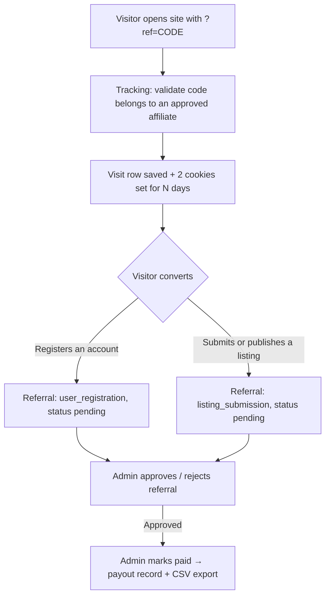

# Directorist – Affiliate

Affiliate tracking and fixed-commission referral system for [Directorist](https://directorist.com/). It lets people apply to become affiliates, hands each approved affiliate a referral link, tracks visits through that link with cookies, and records a fixed commission whenever a referred visitor **registers an account** or **submits/publishes a listing**. Admins moderate affiliates and referrals, record manual payouts, and export approved commissions as CSV.

## At a glance

| Item | Value |
| --- | --- |
| Version | 0.3.0 (plugin) / 0.1.0 (DB schema) |
| Author | wpWax |
| Requires | WordPress 5.8+, PHP 7.4+ |
| Depends on | Directorist ≥ 8.7.3 (declared via `Requires Plugins: directorist`) |
| Text domain | `directorist-affiliate` (no translations shipped yet) |
| Commission model | Fixed amounts only, filterable via hooks (no order/payment integration) |
| Payouts | Manual (recorded by admin; no gateway integration); per-affiliate minimum enforced on bulk payouts |
| Assets | One shared stylesheet + one vanilla JS file (AJAX forms, copy-referral-link button) |
| Forms | All four forms submit via AJAX (`admin-ajax.php`) with full no-JavaScript POST fallbacks |
| User guide | [DOCUMENTATION.md](DOCUMENTATION.md) |

## How it works (big picture)



1. **Application** – A visitor applies via the `[directorist_affiliate_registration]` shortcode (or an admin adds them manually). A WordPress user is created for them if needed. The application starts as `pending`.
2. **Approval** – An admin approves the affiliate; they get a unique referral code and a referral URL like `https://site.com/?ref=CODE`.
3. **Tracking** – When someone lands on any front-end page with `?ref=CODE` (of an approved affiliate), a visit row is logged and two cookies are set for the configured duration.
4. **Conversion** – If that visitor registers, or submits/publishes a listing, a referral row with a fixed commission amount is created (`pending`), the visit is flagged converted, and the affiliate is emailed.
5. **Moderation & payout** – The admin approves referrals, then marks them paid (individually or in bulk), which writes a payout record. Approved commissions can be exported to CSV for processing in a payment tool.

## File structure

```
directorist-affiliate/
├── directorist-affiliate.php            # Bootstrap: constants, autoloader, activation hooks, boot
├── uninstall.php                        # Opt-in data removal on plugin delete
├── .gitignore
├── README.md                            # Technical reference (this file)
├── DOCUMENTATION.md                     # Site-owner user guide
├── docs/
│   └── images/                          # Screenshots/video thumbnail referenced by DOCUMENTATION.md
├── includes/
│   ├── class-autoloader.php             # Classmap autoloader (lazy class loading)
│   ├── class-plugin.php                 # Service container / dependency checks
│   ├── class-activator.php              # dbDelta table creation + default options
│   ├── class-deactivator.php            # flush_rewrite_rules only
│   ├── class-view.php                   # Shared view/template renderer
│   ├── class-registration.php           # Application processing (public + admin flows)
│   ├── class-ajax.php                   # AJAX endpoints for all forms
│   ├── class-settings.php               # Settings read/sanitize/save
│   ├── class-affiliate.php              # Affiliate repository (CRUD, codes, user helper)
│   ├── class-referral.php               # Referral repository (CRUD, sums, dedupe)
│   ├── class-tracking.php               # ?ref= capture, cookies, visit rows
│   ├── class-commission.php             # Fixed commission amount resolution (filterable)
│   ├── class-payout.php                 # Manual payout records
│   ├── class-email.php                  # wp_mail notifications
│   ├── class-shortcodes.php             # Registration + dashboard shortcodes
│   └── class-directorist-integration.php# Hooks into Directorist events
├── admin/
│   ├── class-admin.php                  # Menu, assets, screen rendering
│   ├── class-admin-actions.php          # Form/moderation handlers + CSV export
│   └── views/                           # dashboard, affiliates, referrals,
│                                        # visits, payouts, settings pages
├── public/
│   ├── class-public.php                 # Front-end asset registration + tracking hook
│   └── views/                           # registration-form.php, affiliate-dashboard.php
├── assets/
│   ├── css/directorist-affiliate.css    # Shared front-end + admin styles (design tokens, badges, cards)
│   └── js/directorist-affiliate.js      # Copy-referral-link button
└── languages/                           # (empty)
```

Layering: `directorist-affiliate.php` → `Plugin` container → repositories/services in `includes/` → thin hook classes (`Admin`, `Admin_Actions`, `Public`, `Shortcodes`, `Directorist_Integration`) → templates in `admin/views/` + `public/views/` rendered through `Directorist_Affiliate_View`. Only the bootstrap trio (Plugin, Activator, Deactivator) plus the autoloader are loaded eagerly; every other class loads on first use via the classmap, so admin-only classes never load on front-end requests.

## Bootstrap flow

`directorist-affiliate.php` defines constants (`DIRECTORIST_AFFILIATE_VERSION`, `_DB_VERSION`, `_MIN_DIRECTORIST`, paths) and calls `Directorist_Affiliate_Plugin::boot()`, which registers:

- `plugins_loaded` → dependency check: admin notice if Directorist is missing (`ATBDP()` / `ATBDP_VERSION`) or older than **8.7.3**.
- `plugins_loaded` → text domain loading.
- `directorist_loaded` → singleton instantiation. The container (`Directorist_Affiliate_Plugin::instance()`) builds the services (`settings`, `affiliate`, `tracking`, `referral`, `commission`, `payout`, `email`, `shortcodes`) — class files load on demand via `Directorist_Affiliate_Autoloader` — and registers hook classes: `Public`, `Shortcodes`, `Directorist_Integration`, plus `Admin` and `Admin_Actions` (admin only). Hooks are skipped entirely if the installed Directorist is below the minimum version.

**Activation** hard-blocks (deactivates itself + `wp_die`) unless `directorist/directorist-base.php` is active, then creates tables via `dbDelta()` and seeds default settings. **Deactivation** only flushes rewrite rules — no data is removed. **Uninstall** (`uninstall.php`) removes the four tables, both options, and the related user meta, but only when the "Delete data on uninstall" setting is enabled; otherwise data survives uninstall.

## Database schema

Four custom tables (all `dbDelta`-managed, version tracked in option `directorist_affiliate_db_version`):

### `{prefix}directorist_affiliates`
| Column | Notes |
| --- | --- |
| `id` | PK |
| `user_id` | Linked WP user (nullable, indexed) |
| `status` | `pending` \| `approved` \| `rejected` \| `suspended` (indexed) |
| `referral_code` | **Unique**. Generated from user ID (or an 8-char random string), suffixed `-1`, `-2`… on collision |
| `payout_email`, `website`, `promotional_method`, `application_note` | Application data |
| `date_created`, `date_updated` | Timestamps |

### `{prefix}directorist_affiliate_visits`
| Column | Notes |
| --- | --- |
| `id` | PK |
| `affiliate_id`, `referral_code` | Who the visit is credited to (indexed) |
| `landing_url`, `referrer_url` | Where they landed / came from |
| `ip_address`, `user_agent` | Visitor fingerprint (IP from `REMOTE_ADDR` only) |
| `converted` | 0/1 flag (indexed), set when the visit leads to a referral |
| `referred_user_id`, `listing_id` | Filled on conversion |
| `date_created` | Timestamp (indexed) |

### `{prefix}directorist_affiliate_referrals`
| Column | Notes |
| --- | --- |
| `id` | PK |
| `affiliate_id` | Indexed |
| `referral_type` | `user_registration` \| `listing_submission` (both listing triggers store this type) |
| `referred_user_id`, `listing_id` | Conversion subject (indexed) |
| `commission_amount` | `decimal(18,6)`, fixed amount snapshotted at creation |
| `status` | `pending` \| `approved` \| `rejected` \| `paid` (indexed) |
| `date_created`, `date_approved`, `date_paid`, `notes` | Lifecycle metadata |

### `{prefix}directorist_affiliate_payouts`
| Column | Notes |
| --- | --- |
| `id` | PK |
| `affiliate_id` | Indexed |
| `amount` | Sum of the included referrals' commissions |
| `status` | Always `paid` currently |
| `payment_method` | Always `manual` currently |
| `payout_email` | Snapshot of where to send money |
| `referral_ids` | Comma-separated referral IDs covered by this payout |
| `date_created`, `date_paid`, `notes` | Metadata |

## Core services

| Class | Responsibility |
| --- | --- |
| `Directorist_Affiliate_Settings` | Reads/saves the `directorist_affiliate_settings` option with defaults + sanitization (amounts normalized to `0.00` strings, trigger whitelisted, cookie days ≥ 1). |
| `Directorist_Affiliate_Affiliate` | Affiliate CRUD, status transitions, unique referral-code generation, lookups by ID / user / approved code, display name/email helpers. |
| `Directorist_Affiliate_Tracking` | Captures `?ref=` visits on `template_redirect` (priority 1), writes visit rows, sets/reads cookies, marks visits converted. |
| `Directorist_Affiliate_Referral` | Referral CRUD with **duplicate prevention** (one referral per affiliate + type + user/listing), status updates with date stamping, counts and commission sums. |
| `Directorist_Affiliate_Commission` | Resolves the fixed amount for a conversion, returning `null` (= don't record) when the system or that commission type is disabled, or when the listing trigger doesn't match settings. |
| `Directorist_Affiliate_Payout` | `mark_paid()` validates referrals (must belong to the affiliate and be `approved`), sums them, inserts a payout row, and flips referrals to `paid`. Skips zero-amount payouts. |
| `Directorist_Affiliate_Email` | Plain-text `wp_mail` notices: new application → admin; approve/reject decision → affiliate; new referral recorded → affiliate. |
| `Directorist_Affiliate_View` | Static template renderer (`output()` prints, `render()` returns a string) used by both admin screens and shortcodes. |
| `Directorist_Affiliate_Autoloader` | Classmap `spl_autoload_register` loader; the map doubles as the plugin's class inventory. |
| `Directorist_Affiliate_Registration` | Application processing shared by every entry point: `process_public()` (honeypot, validation, account creation, pending application) and `process_admin()` (status choice, user reuse). Callers do nonce/capability checks. |
| `Directorist_Affiliate_Ajax` | `admin-ajax.php` endpoints for all four forms (`directorist_affiliate_register` incl. `nopriv`, `…_add_affiliate`, `…_save_settings`, `…_mark_paid`), returning JSON via `wp_send_json_*`. |

## Visit tracking details

- Runs on the front end only, and only when the system is enabled in settings.
- The URL parameter name is configurable (`ref` by default) — e.g. `https://site.com/any-page/?ref=42`.
- The code must belong to an **approved** affiliate; logged-in affiliates visiting their own link are ignored (self-referral guard #1).
- Two cookies are set for `cookie_duration` days (default 30), `HttpOnly`, `secure` when SSL:
  - `directorist_affiliate_ref` → affiliate ID
  - `directorist_affiliate_visit` → visit row ID
- Every hit with a valid `?ref=` creates a **new** visit row (last click wins — the cookies are overwritten).

## Conversion → referral creation

`Directorist_Affiliate_Directorist_Integration` listens to:

| Hook | Purpose |
| --- | --- |
| `user_register` + `atbdp_user_registration_completed` | Registration conversions |
| `atbdp_after_created_listing` | Listing conversions when trigger = `submission` |
| `transition_post_status` (→ `publish`, Directorist post type only) | Listing conversions when trigger = `publish` |
| `directorist_dashboard_tabs` (filter) | Adds an "Affiliate" tab to the Directorist user dashboard |

**Registration flow:** commission amount resolved → affiliate read from cookie → must be approved and not the registering user themselves (self-referral guard #2) → referral created as `pending` → user meta `_directorist_affiliate_id` and `_directorist_affiliate_visit_id` stored on the new user → visit marked converted → affiliate emailed.

**Listing flow:** affiliate resolved from the author's `_directorist_affiliate_id` user meta first, falling back to the live cookie — so a listing posted days after registration (cookie may be gone) still credits the original affiliate. Same approval/self-referral guards, then a `listing_submission` referral is created, the visit marked converted, and the affiliate emailed.

Both paths are idempotent: `Referral::create()` returns the existing row if a referral for the same affiliate + type + user/listing already exists, so double-firing hooks can't double-pay.

## Admin area

Top-level menu **Directorist Affiliate** (`manage_options`, icon `dashicons-networking`) with six screens:

| Page (slug) | Contents / actions |
| --- | --- |
| Dashboard (`directorist-affiliate`) | Stat cards: total/pending affiliates, visits, referrals, pending/approved/paid commission totals. |
| Affiliates (`…-affiliates`) | Manual "Add affiliate" form (creates/reuses a WP user, can start as approved), affiliate detail panel, table of affiliates with per-row Approve / Reject / Suspend links (nonce-protected), status badges, and referral/commission rollups. |
| Referrals (`…-referrals`) | All referrals with Approve / Reject / Mark paid actions. "Mark paid" is **restricted to `approved` referrals** and always routes through the payout service so every payment leaves a payout record; other statuses get an error notice. |
| Visits (`…-visits`) | Latest 100 visits: affiliate, landing/referrer URLs, IP, converted badge. |
| Payouts (`…-payouts`) | Checkbox list of unpaid **approved** referrals → "Mark selected as paid" (grouped into one payout per affiliate, **skipping affiliates below the configured minimum payout** with a warning notice); payout history; **Export approved payouts CSV** (up to 1,000 rows: affiliate_id, payout_email, referral_id, amount, date_created). |
| Settings (`…-settings`) | The settings form below. |

Screen rendering lives in `Directorist_Affiliate_Admin`; all mutations live in `Directorist_Affiliate_Admin_Actions`, run through `admin_init`, are capability-checked (`manage_options`) and nonce-verified (`check_admin_referer`), then redirect with a success/error notice.

## Frontend

**Forms are AJAX-first with no-JS fallbacks.** Every form carries a `data-da-ajax` attribute; the shared JS intercepts submit, posts to `admin-ajax.php`, and shows the JSON response inline (invalid input no longer loses what was typed). Without JavaScript, forms fall back to normal POSTs: the front-end registration POST is processed **exactly once on `template_redirect`** (a once-guard prevents the double-processing that occurs when themes/SEO plugins render shortcodes multiple times per request — previously this could report "You already have an affiliate application" on a successful first submit), and admin POSTs are processed on `admin_init` as before. Both paths run the same `Registration`/`Payout` service methods.

**Shortcodes**

- `[directorist_affiliate_registration]` — Application form (name, email, website, promotional channel, payout email, note) with an invisible **honeypot anti-spam field** (bot submissions are silently discarded). For visitors who aren't logged in it **creates a WordPress account** via the shared `Affiliate::register_user()` helper (username derived from the email local-part, random password, standard new-user email). If the email already belongs to an account, it asks them to log in first. One application per user.
- `[directorist_affiliate_dashboard]` — For logged-in affiliates: status badge, visit/referral counts, pending/approved/paid commission totals, their referral URL with a **copy-to-clipboard button** (only shown once approved), payout email, admin-configured payout instructions, and their last 20 referrals.

**Directorist dashboard tab** — The same dashboard renders inside Directorist's user dashboard as an "Affiliate" tab (icon `las la-handshake`) via the `directorist_dashboard_tabs` filter.

Views are rendered with a tiny `ob_start()`/`extract()` template loader; assets are one shared stylesheet and one small vanilla JS file, both registered as `directorist-affiliate` and enqueued on demand.

## Settings reference

Stored in one option, `directorist_affiliate_settings` (autoload off):

| Key | Default | Meaning |
| --- | --- | --- |
| `enabled` | `1` | Master on/off for tracking + commissions |
| `ref_param` | `ref` | Query-string parameter for referral links |
| `cookie_duration` | `30` | Cookie lifetime in days (min 1) |
| `enable_registration` | `1` | Pay commission on referred user registration |
| `registration_amount` | `0.00` | Fixed amount per registration |
| `enable_listing` | `1` | Pay commission on referred listing |
| `listing_amount` | `0.00` | Fixed amount per listing |
| `listing_trigger` | `submission` | `submission` (on create) or `publish` (on first publish) |
| `minimum_payout` | `0.00` | Per-affiliate threshold enforced on the bulk "Mark selected as paid" action (`0` = disabled) |
| `payout_instructions` | `''` | Free text shown on the affiliate dashboard |
| `anonymize_ip` | `0` | Truncate visit IPs via `wp_privacy_anonymize_ip()` at collection time |
| `delete_data_on_uninstall` | `0` | Allow `uninstall.php` to drop tables/options/user meta on plugin delete |

## Status lifecycles

- **Affiliate:** `pending` → `approved` / `rejected` / `suspended` (admin action; approve/reject trigger an email). Only `approved` affiliates get visits and referrals credited.
- **Referral:** `pending` → `approved` (stamps `date_approved`) → `paid` (stamps `date_paid`, normally via a payout record); or `rejected`.
- **Payout:** created directly as `paid` / `manual`.

## Data footprint

| Type | Keys |
| --- | --- |
| Options | `directorist_affiliate_settings`, `directorist_affiliate_db_version` |
| User meta | `_directorist_affiliate_id`, `_directorist_affiliate_visit_id` (on referred users) |
| Cookies | `directorist_affiliate_ref`, `directorist_affiliate_visit` |
| Tables | The four `directorist_affiliate*` tables above |

## Security posture

- Every table access goes through `$wpdb->prepare()`; inputs are sanitized on the way in (`sanitize_email`, `esc_url_raw`, `sanitize_key`, `absint`, …) and escaped on output (`esc_html`, `esc_url`, `esc_attr`).
- All admin actions: `manage_options` + nonces. Frontend application form: nonce-protected POST plus an invisible honeypot field against bot signups.
- Cookies are `HttpOnly` and marked secure on SSL. Statuses/types are validated against whitelists before being written.
- Self-referral is blocked at both the tracking and the referral-creation layers; duplicate referrals are blocked at the repository layer.
- Optional IP anonymization (`wp_privacy_anonymize_ip()`) for visit logs; opt-in full data removal on uninstall.
- Referrals can only be marked paid from the `approved` status, so every payment is backed by a payout record (audit trail).

## Extensibility

Actions: `directorist_affiliate_created( $affiliate_id, $status )`, `directorist_affiliate_status_changed( $affiliate_id, $status )`, `directorist_affiliate_referral_created( $referral_id, $affiliate_id, $type )`, `directorist_affiliate_payout_recorded( $payout_id, $affiliate_id, $amount, $referral_ids )`.

Filters: `directorist_affiliate_registration_commission( $amount )`, `directorist_affiliate_listing_commission( $amount, $trigger )`.

Usage examples are in [DOCUMENTATION.md](DOCUMENTATION.md#developer-reference).

## Known limitations / observations

- Payouts are records only — no PayPal/Stripe/etc. integration; money moves outside WordPress (CSV export supports that workflow).
- Commission amounts are flat fixed values (filterable via the commission hooks); there is no built-in percentage model and no tie-in to Directorist monetization (order totals, plans, paid listings).
- Admin tables have fixed query limits (100 rows; 500 approved referrals on the payout screen) and no pagination or search.
- Visit capture happens on `template_redirect`, so full-page caching can prevent cookie setting for cached hits (standard limitation for cookie-based affiliate tracking).
- Visit rows have no retention/cleanup routine; IP anonymization is available but off by default.
- Both listing triggers record the referral as type `listing_submission`; the trigger used is only distinguishable from the referral's notes.
- Last-click attribution: each valid `?ref=` visit overwrites the previous affiliate cookie.
- No custom capabilities — all admin screens require `manage_options`.
