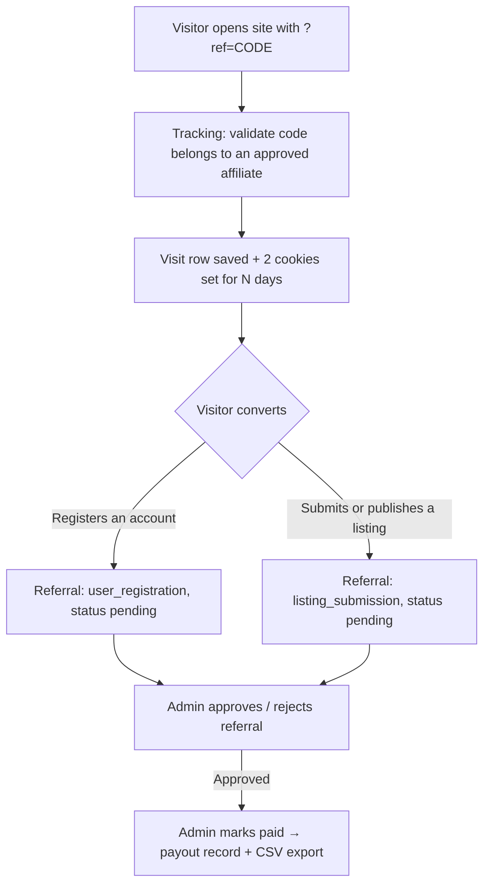

# Directorist – Affiliate

Affiliate tracking and fixed-commission referral system for [Directorist](https://directorist.com/). It lets people apply to become affiliates, hands each approved affiliate a referral link, tracks visits through that link with cookies, and records a fixed commission whenever a referred visitor **registers an account** or **submits/publishes a listing**. Admins moderate affiliates and referrals, record manual payouts, and export approved commissions as CSV.

## At a glance

| Item | Value |
| --- | --- |
| Version | 1.2.1 (plugin) / 0.2.0 (DB schema) |
| Author | [wpXplore](https://wpxplore.com) |
| Website | https://wpxplore.com/tools/directorist-affiliate/ |
| Requires | WordPress 6.3+, PHP 7.4+ |
| Depends on | Directorist ≥ 8.7.3 (declared via `Requires Plugins: directorist`) |
| Text domain | `directorist-affiliate` — fully translatable; POT template at `languages/directorist-affiliate.pot` |
| Commission model | Fixed amounts for registration/listing events; **fixed or percentage of order total** for paid plan/featured orders; all filterable |
| Revenue events | Pricing-plan purchases (requires Pricing Plans extension) and featured-listing purchases (requires Directorist monetization) — auto-disabled when the dependency is missing |
| Payouts | Manual (recorded by admin; no gateway integration); per-affiliate minimum enforced on bulk payouts |
| Assets | One front-end stylesheet + one admin stylesheet + one vanilla JS file (AJAX forms, copy link, link builder, bulk select) |
| Forms | All forms submit via AJAX (`admin-ajax.php`) with full no-JavaScript POST fallbacks |
| User guide | [DOCUMENTATION.md](DOCUMENTATION.md) |

## How it works (big picture)



1. **Application** – A visitor applies via the `[directorist_affiliate_registration]` shortcode (or an admin adds them manually). A WordPress user is created for them if needed. The application starts as `pending`.
2. **Approval** – An admin approves the affiliate; they get a unique referral code and a referral URL like `https://site.com/?ref=CODE`.
3. **Tracking** – When someone lands on any front-end page with `?ref=CODE` (of an approved affiliate), a visit row is logged and two cookies are set for the configured duration.
4. **Conversion** – If that visitor registers, or submits/publishes a listing, a referral row with a fixed commission amount is created (`pending`), the visit is flagged converted, and the affiliate is emailed.
5. **Moderation & payout** – The admin approves referrals, then marks them paid (individually or in bulk), which writes a payout record. Approved commissions can be exported to CSV for processing in a payment tool.

## File structure

```
directorist-affiliate/
├── directorist-affiliate.php            # Bootstrap: constants, autoloader, activation hooks, boot
├── uninstall.php                        # Opt-in data removal on plugin delete
├── .gitignore
├── README.md                            # Technical reference (this file)
├── DOCUMENTATION.md                     # Site-owner user guide
├── docs/
│   └── images/                          # Screenshots/video thumbnail referenced by DOCUMENTATION.md
├── includes/
│   ├── class-autoloader.php             # Classmap autoloader (lazy class loading)
│   ├── class-date-range.php             # Date-range presets → MySQL datetime bounds
│   ├── class-plugin.php                 # Service container / dependency checks
│   ├── class-activator.php              # dbDelta table creation + default options
│   ├── class-deactivator.php            # flush_rewrite_rules only
│   ├── class-view.php                   # Shared view/template renderer
│   ├── class-registration.php           # Application processing (public + admin flows)
│   ├── class-ajax.php                   # AJAX endpoints for all forms
│   ├── class-settings.php               # Settings read/sanitize/save
│   ├── class-affiliate.php              # Affiliate repository (CRUD, codes, user helper)
│   ├── class-referral.php               # Referral repository (CRUD, sums, dedupe)
│   ├── class-tracking.php               # ?ref= capture, cookies, visit rows
│   ├── class-commission.php             # Fixed commission amount resolution (filterable)
│   ├── class-payout.php                 # Manual payout records
│   ├── class-email.php                  # wp_mail notifications
│   ├── class-shortcodes.php             # Registration + dashboard shortcodes
│   ├── class-directorist-integration.php# Registration/listing referrals + dashboard tab
│   └── class-order-integration.php      # Paid-order commissions (new + legacy orders), refund reversal
├── admin/
│   ├── class-admin.php                  # Menu, assets, filter parsing, screen rendering
│   ├── class-admin-actions.php          # Form/moderation handlers + CSV export
│   └── views/                           # dashboard, affiliates, referrals, visits,
│       │                                # payouts-unpaid, payouts-history, settings
│       └── partials/                    # filter-bar.php, payout-sections.php
├── public/
│   ├── class-public.php                 # Front-end asset registration + tracking hook
│   └── views/                           # registration-form.php, affiliate-dashboard.php
├── assets/
│   ├── css/directorist-affiliate.css        # Front-end styles (tokens, hero, stat tiles, badges, tables)
│   ├── css/directorist-affiliate-admin.css  # Admin styles (shell, tabs, toggles, filters, pagination)
│   └── js/directorist-affiliate.js          # Copy link, link builder, AJAX forms, bulk select, sub-tabs
└── languages/                           # (empty)
```

Layering: `directorist-affiliate.php` → `Plugin` container → repositories/services in `includes/` → thin hook classes (`Admin`, `Admin_Actions`, `Public`, `Shortcodes`, `Directorist_Integration`) → templates in `admin/views/` + `public/views/` rendered through `Directorist_Affiliate_View`. Only the bootstrap trio (Plugin, Activator, Deactivator) plus the autoloader are loaded eagerly; every other class loads on first use via the classmap, so admin-only classes never load on front-end requests.

## Bootstrap flow

`directorist-affiliate.php` defines constants (`DIRECTORIST_AFFILIATE_VERSION`, `_DB_VERSION`, `_MIN_DIRECTORIST`, paths) and calls `Directorist_Affiliate_Plugin::boot()`, which registers:

- `plugins_loaded` → dependency check: admin notice if Directorist is missing (`ATBDP()` / `ATBDP_VERSION`) or older than **8.7.3**.
- `plugins_loaded` → text domain loading.
- `directorist_loaded` → singleton instantiation. The container (`Directorist_Affiliate_Plugin::instance()`) builds the services (`settings`, `affiliate`, `tracking`, `referral`, `commission`, `payout`, `email`, `shortcodes`) — class files load on demand via `Directorist_Affiliate_Autoloader` — and registers hook classes: `Public`, `Shortcodes`, `Directorist_Integration`, plus `Admin` and `Admin_Actions` (admin only). Hooks are skipped entirely if the installed Directorist is below the minimum version.

**Activation** hard-blocks (deactivates itself + `wp_die`) unless `directorist/directorist-base.php` is active, then creates tables via `dbDelta()` and seeds default settings. **Deactivation** only flushes rewrite rules — no data is removed. **Uninstall** (`uninstall.php`) removes the four tables, both options, and the related user meta, but only when the "Delete data on uninstall" setting is enabled; otherwise data survives uninstall.

## Database schema

Four custom tables (all `dbDelta`-managed, version tracked in option `directorist_affiliate_db_version`):

### `{prefix}directorist_affiliates`
| Column | Notes |
| --- | --- |
| `id` | PK |
| `user_id` | Linked WP user (nullable, indexed) |
| `status` | `pending` \| `approved` \| `rejected` \| `suspended` (indexed) |
| `referral_code` | **Unique**. Generated from user ID (or an 8-char random string), suffixed `-1`, `-2`… on collision |
| `payout_email`, `website`, `promotional_method`, `application_note` | Application data |
| `date_created`, `date_updated` | Timestamps |

### `{prefix}directorist_affiliate_visits`
| Column | Notes |
| --- | --- |
| `id` | PK |
| `affiliate_id`, `referral_code` | Who the visit is credited to (indexed) |
| `landing_url`, `referrer_url` | Where they landed / came from |
| `ip_address`, `user_agent` | Visitor fingerprint (IP from `REMOTE_ADDR` only) |
| `converted` | 0/1 flag (indexed), set when the visit leads to a referral |
| `referred_user_id`, `listing_id` | Filled on conversion |
| `date_created` | Timestamp (indexed) |

### `{prefix}directorist_affiliate_referrals`
| Column | Notes |
| --- | --- |
| `id` | PK |
| `affiliate_id` | Indexed |
| `referral_type` | `user_registration` \| `listing_submission` \| `plan_purchase` \| `featured_purchase` |
| `referred_user_id`, `listing_id` | Conversion subject (indexed) |
| `order_id`, `order_source`, `order_total` | For order events: the paid order (`directorist` = 8.8+ order repository, `legacy` = `atbdp_orders` post), and its total at commission time (order_id indexed) |
| `commission_amount` | `decimal(18,6)`, amount snapshotted at creation |
| `status` | `pending` \| `approved` \| `rejected` \| `paid` \| `cancelled` \| `refunded` (indexed) |
| `date_created`, `date_approved`, `date_paid`, `notes` | Lifecycle metadata |

### `{prefix}directorist_affiliate_payouts`
| Column | Notes |
| --- | --- |
| `id` | PK |
| `affiliate_id` | Indexed |
| `amount` | Sum of the included referrals' commissions |
| `status` | Always `paid` currently |
| `payment_method` | Always `manual` currently |
| `payout_email` | Snapshot of where to send money |
| `referral_ids` | Comma-separated referral IDs covered by this payout |
| `date_created`, `date_paid`, `notes` | Metadata |

## Core services

| Class | Responsibility |
| --- | --- |
| `Directorist_Affiliate_Settings` | Reads/saves the `directorist_affiliate_settings` option with defaults + sanitization (amounts normalized to `0.00` strings, trigger whitelisted, cookie days ≥ 1). |
| `Directorist_Affiliate_Affiliate` | Affiliate CRUD, status transitions, unique referral-code generation, lookups by ID / user / approved code, display name/email helpers. |
| `Directorist_Affiliate_Tracking` | Captures `?ref=` visits on `template_redirect` (priority 1), writes visit rows, sets/reads cookies, marks visits converted. |
| `Directorist_Affiliate_Referral` | Referral CRUD with **duplicate prevention** (one referral per affiliate + type + user/listing), status updates with date stamping, counts and commission sums. |
| `Directorist_Affiliate_Commission` | Resolves commission amounts per event — fixed for registration/listing, fixed **or percentage of order total** for plan/featured orders. Returns `null` (= don't record) when the system/event is disabled **or the required extension is inactive** (`is_pricing_plans_active()`, `is_featured_monetization_active()`). Also owns the auto-approve default status. |
| `Directorist_Affiliate_Order_Integration` | Listens to both Directorist order systems, creates commissions on paid plan/featured orders (deduped per order), and reverses them to `cancelled`/`refunded` when the order is refunded, cancelled, failed, or expired. |
| `Directorist_Affiliate_Payout` | `mark_paid()` validates referrals (must belong to the affiliate and be `approved`), sums them, inserts a payout row, and flips referrals to `paid`. Skips zero-amount payouts. |
| `Directorist_Affiliate_Email` | Plain-text `wp_mail` notices: new application → admin; approve/reject decision → affiliate; new referral recorded → affiliate. Each is individually toggleable in Settings → Notifications. |
| `Directorist_Affiliate_Date_Range` | Turns a preset (`today`, `this_week`, `last_month`, `last_30`, …) or a custom start/end pair into inclusive MySQL datetime bounds in the site's timezone. Honors `start_of_week`, validates dates with `checkdate()`, and swaps reversed custom ranges. |
| `Directorist_Affiliate_View` | Static template renderer (`output()` prints, `render()` returns a string, `partial()` renders an admin partial with an isolated context) used by both admin screens and shortcodes. |
| `Directorist_Affiliate_Autoloader` | Classmap `spl_autoload_register` loader; the map doubles as the plugin's class inventory. |
| `Directorist_Affiliate_Registration` | Application processing shared by every entry point: `process_public()` (application gates, honeypot, per-IP rate limit of 5/hour for guests, validation, account creation, pending application) and `process_admin()` (status choice, user reuse). Callers do nonce/capability checks. |
| `Directorist_Affiliate_Ajax` | `admin-ajax.php` endpoints for all four forms (`directorist_affiliate_register` incl. `nopriv`, `…_add_affiliate`, `…_save_settings`, `…_mark_paid`), returning JSON via `wp_send_json_*`. |

## Visit tracking details

- Runs on the front end only, and only when the system is enabled in settings.
- The URL parameter name is configurable (`ref` by default) — e.g. `https://site.com/any-page/?ref=42`.
- The code must belong to an **approved** affiliate; logged-in affiliates visiting their own link are ignored (self-referral guard #1).
- Two cookies are set for `cookie_duration` days (default 30), `HttpOnly`, `secure` when SSL:
  - `directorist_affiliate_ref` → affiliate ID
  - `directorist_affiliate_visit` → visit row ID
- Attribution is configurable: **first click** (default, per PRD — an existing valid credit is never overwritten until the cookie expires) or **last click** (each valid `?ref=` hit overwrites the credit). Every counted hit creates a visit row.
- Obvious crawler traffic (bot/crawler/spider/headless/curl user agents, and requests with no user agent) is skipped, so click counts and conversion rates reflect real visitors. Capture also bails if headers were already sent.

## Conversion → referral creation

`Directorist_Affiliate_Directorist_Integration` listens to:

| Hook | Purpose |
| --- | --- |
| `user_register` + `atbdp_user_registration_completed` | Registration conversions |
| `atbdp_after_created_listing` | Listing conversions when trigger = `submission` |
| `transition_post_status` (→ `publish`, Directorist post type only) | Listing conversions when trigger = `publish` |
| `directorist_after_order_create` / `directorist_after_order_update` (Directorist 8.8+ order repository) | Paid-order commissions: `ref_type` `pricing_plan` → `plan_purchase`, `featured_listing`/featured flag → `featured_purchase`; reversal when the order becomes refunded/cancelled/failed/expired |
| `atbdp_order_completed` + `atbdp_order_status_changed` (legacy `atbdp_orders`) | Same for the classic checkout: `_fm_plans` meta → plan, `_featured` meta → featured; admin status changes to cancelled/refunded reverse the commission |
| `directorist_dashboard_tabs` (filter) | Adds an "Affiliate" tab to the Directorist user dashboard |

**Paid order flow:** when an order reaches **paid**, the integration computes the total exactly like core (`sub_total` + tax − coupon, falling back to the stored amount), resolves the affiliate (tracking cookie first, then the affiliate recorded at the buyer's registration), applies the self-referral and per-order duplicate guards, and creates a `plan_purchase`/`featured_purchase` referral storing the order ID, source, and total. Free (0.00) orders never earn. If the order is later refunded or cancelled, the referral flips to `refunded`/`cancelled` and drops out of payable sums; `directorist_affiliate_referral_reversed` fires for extensions.

**Registration flow:** affiliate read from cookie → must be approved and not the registering user themselves (self-referral guard #2) → user meta `_directorist_affiliate_id` / `_directorist_affiliate_visit_id` stored on the new user **regardless of whether the registration commission event is enabled**, so later conversions still attribute → if the event is enabled, a `pending` referral is created, the visit marked converted, and the affiliate emailed.

**Listing flow:** affiliate resolved from the author's `_directorist_affiliate_id` user meta first, falling back to the live cookie **only when the current session belongs to the listing author** — so a listing posted days after registration still credits the original affiliate, while a moderator publishing someone else's listing can never leak their own cookie into the attribution. Same approval/self-referral guards, then a `listing_submission` referral is created, the visit marked converted, and the affiliate emailed.

**Cookie trust rule (all order/listing events):** the tracking cookie belongs to a browser session, so it is only consulted when the current user *is* the converting user (or a guest completing their own checkout). Admin-side events — offline-payment approval, order status edits, moderator publishing — attribute exclusively through the persisted user meta. The first affiliate credited to a user is written to user meta and never overwritten, which keeps first-click semantics across devices and cookie expiry.

Both paths are idempotent: `Referral::create()` returns the existing row if a referral for the same affiliate + type + user/listing already exists, so double-firing hooks can't double-pay.

## Admin area

One tabbed **Affiliate** page registered as a submenu of the Directorist listings menu (`edit.php?post_type=at_biz_dir`, page slug `directorist-affiliate`, `manage_options`). The shell renders a header (title, version chip, tagline) and a six-tab navigation (`?tab=…`, dashicons, whitelisted via `sanitize_key`); `Directorist_Affiliate_Admin::page_url( $tab, $args )` is the canonical URL builder used by every internal link, redirect, and email. Bookmarks to the old standalone `directorist-affiliate-*` pages 301 to the matching tab on `admin_init`.

| Tab (`?tab=`) | Contents / actions |
| --- | --- |
| `dashboard` | Stat tiles (affiliates + pending-application shortcut, visits with conversion rate, referrals) and commission tiles (pending / approved / paid), plus the 8 most recent referrals. |
| `affiliates` | An **Add affiliate** button leads the filter bar and opens a native `<dialog>` **modal** (creates/reuses a WP user, can start as approved); affiliate detail card; filters (status, search across name/email/code/website, applied-date range); **paginated** table (20/page) with per-row Approve / Reject / Suspend links (nonce-protected; the action matching the current status is hidden) and referral/commission rollups from one grouped query. |
| `referrals` | Filters: **affiliate, event type, status, and date range**; 20/page; **bulk actions** (Approve / Reject / Mark as paid) alongside per-row actions. "Mark paid" is **restricted to `approved` referrals** and always routes through the payout service so every payment leaves a payout record; other statuses get an error notice. |
| `visits` | Filters: **affiliate, converted/not converted, and date range**; 20/page. Columns: affiliate + code, landing path, referring host, IP, timestamp, converted badge. |
| `payouts` | Two sub-tabs (`&section=`). **Unpaid approved commissions** (`unpaid`, default): outstanding-balance toolbar, checkbox list with select-all → "Mark selected as paid" (grouped into one payout per affiliate, **skipping affiliates below the configured minimum payout** with a warning notice), and **Export approved payouts CSV** (up to 1,000 rows: affiliate_id, payout_email, referral_id, amount, date_created — cells starting with `=`/`+`/`-`/`@` are neutralized against spreadsheet formula injection). **Payout history** (`history`): filters by **affiliate, payout email, and date range** with a total-paid summary, 20/page, each row linking to that affiliate's referrals. |
| `settings` | The settings form below, organized into pill-style sub-tabs (General / Commissions / Payout / Notifications / Advanced) with toggle switches, inline field descriptions, and a **sticky save bar**. One form underneath — a single save submits every section (AJAX with POST fallback); JS-off renders the sections stacked. Sub-tab state is kept in the URL hash (`#da-general`); leaving with unsaved changes warns first. |

Tab rendering lives in `Directorist_Affiliate_Admin`; all mutations live in `Directorist_Affiliate_Admin_Actions`, run through `admin_init`, are capability-checked (`manage_options`) and nonce-verified (`check_admin_referer`), then redirect back to the relevant tab with a success/error notice (or return JSON via the AJAX endpoints).

## Frontend

**Forms are AJAX-first with no-JS fallbacks.** Every form carries a `data-da-ajax` attribute; the shared JS intercepts submit, posts to `admin-ajax.php`, and shows the JSON response inline (invalid input no longer loses what was typed). Without JavaScript, forms fall back to normal POSTs: the front-end registration POST is processed **exactly once on `template_redirect`** (a once-guard prevents the double-processing that occurs when themes/SEO plugins render shortcodes multiple times per request — previously this could report "You already have an affiliate application" on a successful first submit), and admin POSTs are processed on `admin_init` as before. Both paths run the same `Registration`/`Payout` service methods.

**Shortcodes**

- `[directorist_affiliate_registration]` — Application form (name, email, website, promotional channel, payout email, note) with an invisible **honeypot anti-spam field** (bot submissions are silently discarded). For visitors who aren't logged in it **creates a WordPress account** via the shared `Affiliate::register_user()` helper (username derived from the email local-part, random password, standard new-user email). If the email already belongs to an account, it asks them to log in first. One application per user.
- `[directorist_affiliate_dashboard]` — For logged-in affiliates: an earnings hero with status badge and their referral URL + **copy-to-clipboard button** (only once approved), stat tiles (visits with conversion rate, referrals, pending/approved/paid), a **link builder** for deep links to Add Listing / All Listings / Checkout, payout email and instructions, their last 20 referrals, and their **payout history**.
- `[directorist_affiliate_link page="add-listing" text="Add your business"]` — Renders the current affiliate's referral link to a named Directorist page (`home`, `add-listing`, `all-listings`, `dashboard`, `checkout`) or an explicit same-site `url`. Outputs nothing for visitors who are not approved affiliates.

**Directorist dashboard tab** — The same dashboard renders inside Directorist's user dashboard as an "Affiliate" tab (icon `las la-handshake`) via the `directorist_dashboard_tabs` filter.

The registration shortcode also respects the application gates: it shows a "closed" notice when `enable_applications` is off, a login prompt when `applications_require_login` is on, and an "already applied" notice for users who have an application.

Views are rendered with a tiny `ob_start()`/`extract()` template loader. Assets: `assets/css/directorist-affiliate.css` (front end, registered as `directorist-affiliate`), `assets/css/directorist-affiliate-admin.css` (admin only), and one vanilla JS file shared by both, enqueued with `strategy => defer`.

## List filtering

Every list screen shares one GET-based filter bar (`admin/views/partials/filter-bar.php`), so filters are bookmarkable, survive pagination, and need no JavaScript. `Directorist_Affiliate_Admin::request_filters()` parses the request once; `pagination_args()` reduces it to the non-empty query vars that pagination links must carry.

| Screen | Query vars |
| --- | --- |
| Affiliates | `status`, `s` (name/email/code/website), date range |
| Referrals | `affiliate`, `type`, `status`, date range |
| Visits | `affiliate`, `converted` (`1`/`0`), date range |
| Payouts → history | `affiliate`, `email`, date range |

**Date range** is shared by all four: `range` holds a preset (`today`, `yesterday`, `this_week`, `last_week`, `this_month`, `last_month`, `last_7`, `last_30`, `this_year`) or `custom`, in which case `from` and `to` carry `Y-m-d` dates. Picking a preset auto-submits; choosing "Custom range…" reveals two native date inputs. Bounds are inclusive and computed in the site's timezone — `this_week` respects the `start_of_week` option, and a reversed custom range is swapped rather than returning nothing. Referrals, visits, and affiliates filter on `date_created`; payout history filters on `COALESCE(date_paid, date_created)`, so "paid in March" means what an admin expects.

Affiliate filters are a dropdown built from `Affiliate::options()` rather than a text field, so they always resolve to a real affiliate ID.

The bar also takes an optional `lead_button` (`array{modal, label}`), rendered as the first control — used by the Affiliates screen for "Add affiliate". It is a `type="button"`, so it opens the modal without submitting the surrounding GET form. It carries the plugin's own `.directorist-affiliate-add-btn` styling rather than WordPress's `.button-primary`, whose `:focus` rule paints a white inner ring that lingers after a mouse click; keyboard focus still shows a ring via `:focus-visible`.

## Settings reference

Stored in one option, `directorist_affiliate_settings` (autoload off):

| Key | Default | Meaning |
| --- | --- | --- |
| `enabled` | `1` | Master on/off for tracking + commissions |
| `ref_param` | `ref` | Query-string parameter for referral links |
| `cookie_duration` | `30` | Cookie lifetime in days (clamped to 1–3650) |
| `enable_applications` | `1` | Accept new affiliate applications (form shows a "closed" notice when off) |
| `applications_require_login` | `0` | Require a WordPress account to apply; when off, applying creates one |
| `enable_registration` | `1` | Pay commission on referred user registration |
| `registration_amount` | `0.00` | Fixed amount per registration |
| `enable_listing` | `1` | Pay commission on referred listing |
| `listing_amount` | `0.00` | Fixed amount per listing |
| `listing_trigger` | `submission` | `submission` (on create) or `publish` (on first publish) |
| `attribution_model` | `first_click` | `first_click` (existing credit kept until cookie expiry) or `last_click` (newest link wins) |
| `enable_plan_commission` | `1` | Commission on pricing-plan purchases — inert unless a Pricing Plans extension is active |
| `plan_commission_type` / `plan_commission_value` | `percentage` / `0.00` | Fixed amount or % of order total (percentages capped at 100) |
| `enable_featured_commission` | `1` | Commission on featured-listing purchases — inert unless monetization + featured listings are enabled |
| `featured_commission_type` / `featured_commission_value` | `percentage` / `0.00` | Fixed amount or % of order total (percentages capped at 100) |
| `auto_approve_commissions` | `0` | Create referrals as `approved` (payable immediately) instead of `pending` |
| `minimum_payout` | `0.00` | Per-affiliate threshold enforced on the bulk "Mark selected as paid" action (`0` = disabled) |
| `payout_instructions` | `''` | Free text shown on the affiliate dashboard |
| `notify_admin_application` | `1` | Email the admin when someone applies |
| `notify_affiliate_status` | `1` | Email the applicant on approve/reject |
| `notify_affiliate_referral` | `1` | Email the affiliate when a referral converts |
| `anonymize_ip` | `0` | Truncate visit IPs via `wp_privacy_anonymize_ip()` at collection time |
| `delete_data_on_uninstall` | `0` | Allow `uninstall.php` to drop tables/options/user meta on plugin delete |

## Status lifecycles

- **Affiliate:** `pending` → `approved` / `rejected` / `suspended` (admin action; approve/reject trigger an email). Only `approved` affiliates get visits and referrals credited.
- **Referral:** `pending` → `approved` (stamps `date_approved`) → `paid` (stamps `date_paid`, normally via a payout record); or `rejected`. A `paid` referral is **locked**: it can only move to `refunded`/`cancelled` (an order reversal). Re-approving it would queue a second payment, so `Referral::update_status()` refuses that transition for both single-row and bulk actions.
- **Payout:** created directly as `paid` / `manual`.

## Data footprint

| Type | Keys |
| --- | --- |
| Options | `directorist_affiliate_settings`, `directorist_affiliate_db_version` |
| User meta | `_directorist_affiliate_id`, `_directorist_affiliate_visit_id` (on referred users) |
| Cookies | `directorist_affiliate_ref`, `directorist_affiliate_visit` |
| Tables | The four `directorist_affiliate*` tables above |

## Security posture

- Every table access goes through `$wpdb->prepare()`; inputs are sanitized on the way in (`sanitize_email`, `esc_url_raw`, `sanitize_key`, `absint`, …) and escaped on output (`esc_html`, `esc_url`, `esc_attr`).
- All admin actions: `manage_options` + nonces. Frontend application form: nonce-protected POST, an invisible honeypot field, a **per-IP rate limit** (5 guest applications per hour), and admin-controlled gates for whether applications are open at all and whether a login is required — so the form can never be used as an unbounded account-creation endpoint.
- CSV export neutralizes spreadsheet formula injection (cells beginning `=`, `+`, `-`, `@`, tab, or CR are prefixed with an apostrophe).
- Cookies are `HttpOnly` and marked secure on SSL. Statuses/types are validated against whitelists before being written.
- Self-referral is blocked at both the tracking and the referral-creation layers; duplicate referrals are blocked at the repository layer. The tracking cookie is only trusted for the converting user's own session (see the cookie trust rule above).
- `Payout::mark_paid()` records and flips **only** the referral IDs it validated (approved and owned by that affiliate), so an unrelated ID passed in a payout request can never be marked paid.
- Optional IP anonymization (`wp_privacy_anonymize_ip()`) for visit logs; opt-in full data removal on uninstall.
- Referrals can only be marked paid from the `approved` status, so every payment is backed by a payout record (audit trail).

## Extensibility

Actions: `directorist_affiliate_created( $affiliate_id, $status )`, `directorist_affiliate_status_changed( $affiliate_id, $status )`, `directorist_affiliate_referral_created( $referral_id, $affiliate_id, $type )`, `directorist_affiliate_referral_reversed( $referral_id, $new_status, $order_status )`, `directorist_affiliate_payout_recorded( $payout_id, $affiliate_id, $amount, $referral_ids )`.

Filters: `directorist_affiliate_registration_commission( $amount )`, `directorist_affiliate_listing_commission( $amount, $trigger )`, `directorist_affiliate_plan_commission( $amount, $order_total )`, `directorist_affiliate_featured_commission( $amount, $order_total )`, `directorist_affiliate_link_targets( $targets, $code )` (destinations offered by the dashboard link builder).

Usage examples are in [DOCUMENTATION.md](DOCUMENTATION.md#developer-reference).

## Changelog

### 1.2.1 — 2026-08-13

- **Fix:** filter dropdown labels ran underneath the dropdown arrow ("All affiliates", "All statuses", "Bulk actions"). Normalizing the control heights in 1.2.0 applied a flat horizontal padding to selects, which overrode the trailing space WordPress reserves for the arrow it paints as a background image (`appearance: none` + a background SVG at the trailing edge). Selects now size to their longest option with explicit arrow clearance, buttons hug their label, and the search field keeps a fixed typing width — all still on the shared height token.
- Arrow clearance uses logical padding, so it follows the writing direction in RTL, where WordPress flips the arrow to the opposite edge.

### 1.2.0 — 2026-08-13

**Filtering and search**
- New shared **date-range filter** on Affiliates, Referrals, Visits, and Payout history: presets (today, yesterday, this/last week, this/last month, last 7/30 days, this year) plus a custom start/end picker. Bounds are inclusive, timezone-correct, `start_of_week`-aware, and reversed custom ranges are swapped instead of silently returning nothing.
- **Referrals** filter by affiliate, event type, status, and date; **Visits** by affiliate, converted state, and date; **Payout history** by affiliate, payout email, and date. All are plain GET forms, so filtered views are bookmarkable and survive pagination.
- Affiliate filters use a dropdown from the affiliate list rather than free text, so they always resolve to a real ID.

**Payouts**
- Split into two sub-tabs: **Unpaid approved commissions** and **Payout history** (`&section=`). History is paginated at 20/page, shows a total-paid figure for the current filters, names how many commissions each payout covered, and links each row to that affiliate's referrals.

**Admin UI**
- **Add affiliate** sits at the start of the Affiliates filter bar (before the status filter) and carries the plugin's own button styling — WordPress's `.button-primary` focus ring left a white outline stuck on the button after clicking it.
- **Add affiliate** moved into a native `<dialog>` modal — browser-provided focus trapping, Escape to close, and backdrop click-to-dismiss; validation errors render inside the modal instead of behind it.
- Directorist core's `.directorist-deprecated-item-notice` is hidden on the Affiliate screen (our stylesheet only loads there, so other admin pages are untouched).
- Admin assets are matched against the screen's exact hook suffix returned by `add_submenu_page()` rather than a substring, guaranteeing they load on this one page and nowhere else.
- Every control in a filter, bulk-action, or toolbar row shares one height token (`--da-control-h`), so selects, inputs, and buttons line up instead of disagreeing by a few pixels — WordPress ships different metrics for each.
- The header's "Program active / disabled" chip drops the default admin link underline and blue; it links to Settings but reads as a status indicator, with the dot carrying the state.

**Internal**
- `Referral::count()`, `Tracking::list()/count()`, `Payout::list()/count()` and `Affiliate::count()` now take an args array and share one private `build_where()` per repository, so every filter is applied identically to the rows and the count. `Payout::sum()` added for the history total.

### 1.1.0 — 2026-08-13

**Attribution correctness**
- **Fix:** the tracking cookie is no longer trusted for conversions processed outside the referred user's own session. An admin approving an offline payment, editing an order status, or publishing a listing could previously have their own `?ref=` cookie credited to someone else's conversion. Order and listing events now attribute through the persisted `_directorist_affiliate_id` user meta unless the current session *is* the converting user.
- **Fix:** the referred-user ↔ affiliate mapping is now stored at registration **even when the registration commission event is disabled**. Previously, turning that event off silently broke attribution for every later conversion by that user.
- The first affiliate credited to a user is persisted and never overwritten (first-click semantics survive cookie expiry and device changes).
- **Fix:** `Payout::mark_paid()` recorded the full submitted ID list on the payout row while only summing validated referrals; it now records and flips exactly the validated set.
- **Fix:** a referral already marked `paid` could be moved back to `approved` (by the row action or the new bulk action), re-queueing it for a second payment. Paid referrals are now locked to reversal statuses only.
- Crawler traffic is filtered out of visit tracking, so click counts and conversion rates reflect real visitors.

**Security**
- Affiliate applications are now gated by two settings — **Accept applications** and **Require login to apply** — plus a per-IP rate limit (5 guest applications/hour). The public form previously created WordPress accounts with no throttle and no way to close applications.
- CSV export neutralizes spreadsheet formula injection (`=`, `+`, `-`, `@`, tab, CR).
- `cookie_duration` is clamped to a 1–3650 day range.

**Admin experience**
- Affiliates and Referrals screens gained **filters, search, and pagination**; Visits is paginated too. Row-level rollups now come from one grouped query instead of two queries per row (an N+1 that scaled with the affiliate count).
- **Bulk actions** on Referrals: approve, reject, or mark paid in one submit.
- Dashboard rebuilt around stat tiles with an icon system, a visit→conversion rate, a pending-applications shortcut, and a recent-referrals table.
- Settings reorganized (General / Commissions / Payout / Notifications / Advanced) with toggle switches, per-field descriptions, a sticky save bar, an unsaved-changes guard, and a shortcode reference card.
- Payouts screen shows the outstanding balance; select-all checkboxes on both bulk tables.
- Page header shows a live "Program active/disabled" indicator and a pending-application count on the Affiliates tab.

**Affiliate experience**
- Front-end dashboard rebuilt: earnings hero, stat tiles with conversion rate, **link builder** for deep links, **payout history**, and clear messaging for pending/suspended/rejected states.
- New `[directorist_affiliate_link]` shortcode (PRD AFF-016) for page-specific referral links, with the `directorist_affiliate_link_targets` filter.
- Money now renders in the site's Directorist currency everywhere (admin, dashboard, emails) instead of bare numbers.

**Notifications**
- Each of the three emails can be toggled independently (PRD AFF-013).

**Compatibility**
- Minimum WordPress raised to **6.3** (scripts are enqueued with the `strategy => defer` signature introduced in 6.3).

**Design system**
- Front-end and admin styles split into two token-based stylesheets sharing one visual language; toggle switches, badges with status dots, card surfaces, responsive stacked tables on mobile, RTL-safe logical properties, `prefers-reduced-motion` support, and focus-visible rings throughout.

### 1.0.0 — 2026-07-28
- **Internationalization complete:** every user-facing string is translatable. Raw database values (referral types and statuses) now render through translated label helpers — `Referral::type_label()`, `Referral::status_label()`, `Affiliate::status_label()` — in admin tables, the front-end dashboard, and emails. Badge CSS classes still derive from raw statuses, so styling is language-independent (`text-transform: capitalize` removed in favor of properly cased labels).
- Added the translation template `languages/directorist-affiliate.pot` (~180 strings, generated with WP-CLI `i18n make-pot`).
- Rebrand: author **wpXplore**, plugin website https://wpxplore.com/tools/directorist-affiliate/, refreshed plugin description.

### 0.5.2 — 2026-07-27
- **Fix:** admin AJAX submissions (Settings, Add Affiliate, bulk payouts) failed with "Something went wrong" — `admin-ajax.php` also fires `admin_init`, so the no-JS fallback handlers intercepted AJAX requests and replied with a redirect instead of JSON. Fallbacks now bail on `wp_doing_ajax()`.

### 0.5.1 — 2026-07-27
- Settings tab organized into pill-style **sub-tabs** (General / Registration Commission / Listing Commission / Order Commissions / Payout / Advanced). Still one form — a single save submits every section via AJAX; sections render stacked without JavaScript; active sub-tab kept in the URL hash.

### 0.5.0 — 2026-07-27
- Admin restructured into a single tabbed **Affiliate** page under the Directorist menu (previously a standalone top-level menu with six subpages). New shell design: header with version chip, dashicon tab navigation, card layout.
- `Directorist_Affiliate_Admin::page_url()` centralizes every admin URL (links, redirects, CSV export, email links); bookmarks to the old `directorist-affiliate-*` page slugs redirect to the matching tab.
- AJAX notices now anchor to `.wp-header-end` (full-width, above the tab bar).

### 0.4.0 — 2026-07-27
- **Revenue-backed commissions (PRD MVP):** commissions on paid orders — pricing-plan purchases (`plan_purchase`) and featured-listing purchases (`featured_purchase`) — as a **fixed amount or percentage of the order total**.
- Integrates both Directorist order systems: the 8.8+ order repository (`directorist_after_order_create/update`, used by Pricing Plans v4 and the featured checkout) and legacy `atbdp_orders` (`atbdp_order_completed`, `atbdp_order_status_changed`).
- **Refund handling:** orders that become refunded/cancelled/failed/expired automatically reverse their referral to the new `refunded`/`cancelled` statuses; `directorist_affiliate_referral_reversed` action added.
- Extension-aware validation: plan commissions require the Pricing Plans extension, featured commissions require monetization + featured listings — settings grey out and runtime guards disable the event when missing.
- Configurable **attribution model**: first click (new default, per PRD) or last click.
- **Auto-approve commissions** setting (applies to all referral types; stamps `date_approved`).
- DB schema 0.2.0: `order_id`, `order_source`, `order_total` columns on referrals (indexed) with automatic `dbDelta` upgrade; per-order commission dedupe; free (0.00) orders never earn.
- New filters `directorist_affiliate_plan_commission` / `directorist_affiliate_featured_commission`; Referrals screen gained an Order column and new status badges.

### 0.3.0 — 2026-07-27
- **All four forms are AJAX-powered** (front-end application incl. logged-out visitors, admin Add Affiliate, Settings, bulk payouts) via `Directorist_Affiliate_Ajax`, with full no-JS fallbacks.
- **Fix:** the front-end application form could process a submission twice (themes/SEO plugins render content multiple times per request), showing "You already have an affiliate application" on a successful first submit. The fallback now processes the POST exactly once on `template_redirect`.
- New `Directorist_Affiliate_Registration` service shares application processing between public/admin/AJAX entry points; bulk payout grouping moved into `Payout::mark_paid_bulk()`.
- Inline success/error notices without losing typed input; per-form success behavior (hide / reload / stay).

### 0.2.0 — 2026-07-27
- Security & privacy: invisible honeypot on the application form, optional visitor-IP anonymization (`wp_privacy_anonymize_ip`), opt-in **uninstall cleanup** (`uninstall.php` + setting).
- Payout integrity: **minimum payout enforced** on bulk payouts (with skip notices); "Mark paid" restricted to approved referrals so every payment leaves a payout record.
- Extensibility: `directorist_affiliate_created`, `_status_changed`, `_referral_created`, `_payout_recorded` actions and registration/listing commission filters.
- Design overhaul: design tokens, stat cards, colored status badges, responsive tables, styled forms, copy-referral-link button (new JS asset).
- Architecture: classmap autoloader (lazy class loading), shared `View` renderer, `Admin`/`Admin_Actions` split, container-managed services; shared `register_user()` helper; real referral `count()` queries.
- Project hygiene: `.gitignore`, technical `README.md`, site-owner `DOCUMENTATION.md`, admin success/error notices.

### 0.1.0
- Initial release: affiliate applications with admin approval, unique referral codes, cookie-based visit tracking, fixed commissions for referred user registrations and listing submissions, self-referral and duplicate guards, manual payouts with CSV export, admin screens (dashboard, affiliates, referrals, visits, payouts, settings), front-end shortcodes, Directorist user-dashboard tab, and email notifications.

## Known limitations / observations

- Payouts are records only — no PayPal/Stripe/etc. integration; money moves outside WordPress (CSV export supports that workflow).
- Claim-listing and ad-package purchases are not yet distinct commission events (the extensions aren't part of this stack); orders that are neither plan nor featured purchases are ignored.
- Recurring/renewal commissions are not implemented (each paid order earns once; subscription renewals that create new paid orders do earn again via order dedupe being per-order).
- The payout screen still loads up to 500 approved referrals at once (it is a work queue, not a browsable archive); every other list screen is paginated at 20 rows.
- Visit capture happens on `template_redirect`, so full-page caching can prevent cookie setting for cached hits (standard limitation for cookie-based affiliate tracking). Exclude `?ref=` URLs from your page cache.
- Visit rows have no retention/cleanup routine; IP anonymization is available but off by default.
- Both listing triggers record the referral as type `listing_submission`; the trigger used is only distinguishable from the referral's notes.
- Attribution is cookie-scoped; conversions after cookie expiry credit no one (order events fall back to the affiliate stored at the buyer's registration, when there was one).
- No custom capabilities — all admin screens require `manage_options`.
